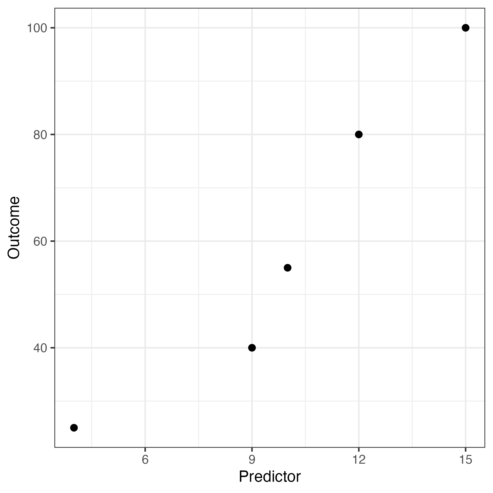
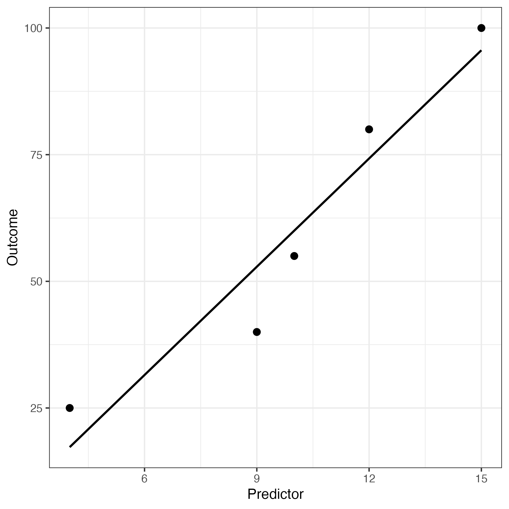
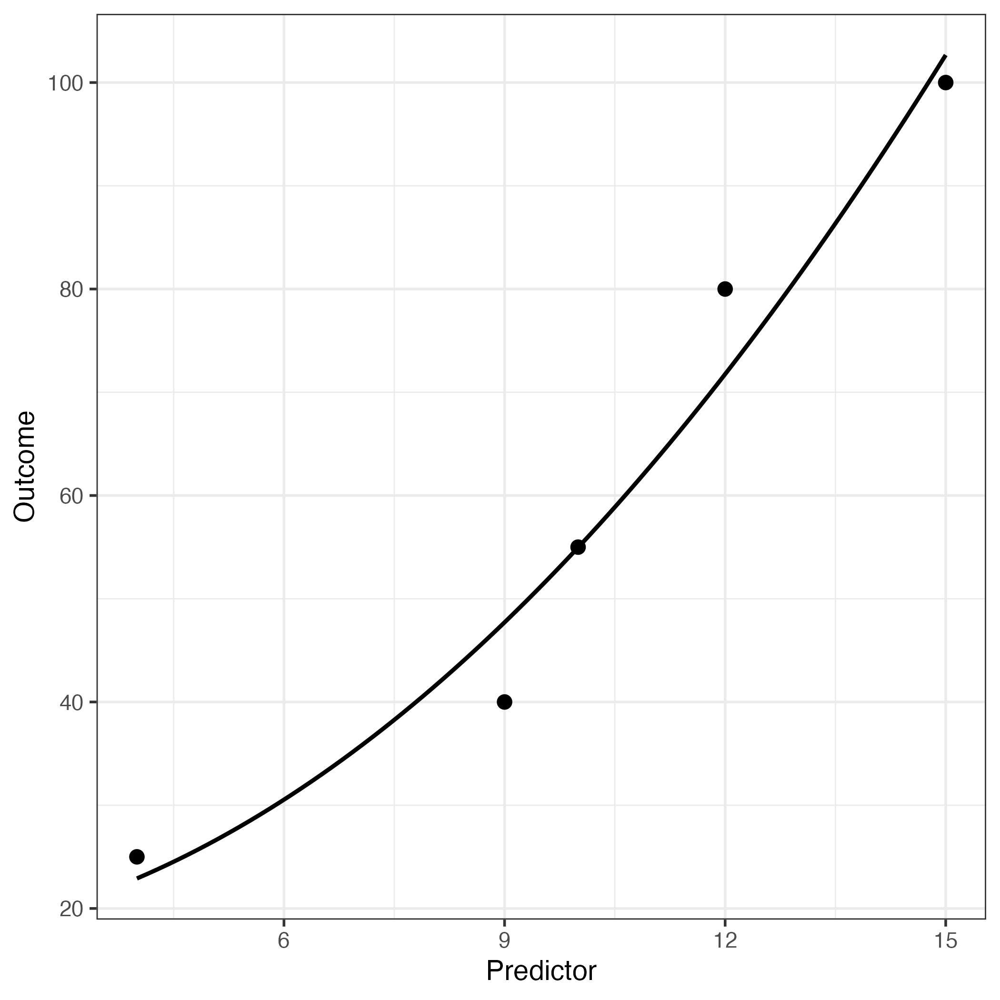

```{r setup, include = FALSE}
knitr::opts_chunk$set(echo = TRUE)
```

# B0: R code underlying the manuscript and appendices A and B

> **We recommend to put the manuscript right next to this vignette.**

## Table 1
Note. See headline 'Principles of supervised ML applications' in the manuscript.
```{r echo=TRUE}
# ds: data set
(ds <- data.frame(x=c(4, 9, 10, 12, 15),
                  y=c(25, 40, 55, 80, 100)))
```

## Use 'ggplot2' to generate figures
```{r echo=TRUE, eval = FALSE}
# install ggplot2, if it has never been installed. Remove leading #-symbol first, else the code line will be ignored.
# install.packages("ggplot2")
# load the 'ggplot2' package
library(ggplot2)
```

## Figure 1 (requires R package 'ggplot2')
```{r echo=TRUE, eval = FALSE}
ggplot(data = ds, aes(x=x, y=y)) +
    geom_point(size=3) +
    theme_bw(base_size = 16) +
    xlab("Predictor") + ylab("Outcome")
```
Note. For figure 1, see headline 'Step 1: Data preprocessing' in the manuscript.

{width=400pt, height=400pt}

## Step 1: Preprocessing. Square the predictor values.
See step 1 and code example between steps 2 and 3 in the manuscript.
```{r echo=TRUE}
# Squared x and append new variable to ds
ds$x2 <- ds$x**2
```

## Figure 1A, left plot
Note. See appendix A in the manuscript (requires R package 'ggplot2').
```{r echo=TRUE, eval = FALSE}
ggplot(ds, aes(x, y)) +
    geom_point(size=3) +
    stat_smooth(method = "lm", se = FALSE,
                formula = y ~ x, size = 1, colour = "black") +
    theme_bw(base_size = 14) +
    xlab("Predictor") + ylab("Outcome")
```

{width=400pt, height=400pt}

## Linear (Lin) model (mod) with original predictor values
Note. See appendix B of the manuscript. lm() = linear model command in R.
```{r echo=TRUE}
modLin <- lm(y ~ x, data = ds)
summary(modLin)
```

Approximately 92 percent explained outcome variance (multiple R-squared = 0.917).

## Figure 1A, right plot
Note. See appendix A in the manuscript (requires R package 'ggplot2').
```{r echo=TRUE, eval = FALSE}
ggplot(ds, aes(x, y)) +
    geom_point(size=3) +
    stat_smooth(method = "lm", se = FALSE,
                formula = y ~ I(x^2), size = 1, colour = "black") +
    theme_bw(base_size = 14) +
    xlab("Predictor") + ylab("Outcome")
```

{width=400pt, height=400pt}

## Quadratic (Quad) model (mod) with squared predictor values
Note. See appendix A in the manuscript and code example under the headline 'Preview of how the main sML goal is pursued' in the manuscript.
```{r echo=TRUE}
modQuad <- lm(y ~ x2, data = ds)
summary(modQuad)
```

96 percent explained outcome variance (multiple R-squared = 0.9619).

## Code example in the manuscript, intercept and regression weight:
Note. See code example between steps 2 and 3 in the manuscript.
```{r echo=TRUE}
lm(y ~ x2, data = ds)
```

## Predicted outcome value, with seven as predictor value
The linear model has already been estimated, see above (Quadratic model: modQuad).

Note. See text below the code example under the headline 'Preview of how the main sML goal is pursued' in the manuscript.
```{r echo=TRUE}
# New predictor value
newPredVal <- 7
# Plug the squared predictor value into the prediction model, using to the 'predict' function.
predict(modQuad, newdata = data.frame(x2=newPredVal**2)) # result = 35.5
```

## Figures 3 and 4, lower tables, without tuning
Note. See headline 'sML - Steps 3-6' in the manuscript.

First, display the upper table in figure 4, with the squared predictor (column x2) and outcome values (column y).
```{r echo=TRUE}
ds[,c("x2", "y")]
```
Under the headline 'Demonstration of sML steps 4–6' in the manuscript, various results are shown. The following code shows how one ends up with the two results 4.4 and 41.5 (see table 2 in the manuscript, first row, second and third column).

### Four training sessions

Each training session is followed by one test performance.

Reminder: The first of the five observations the upper table in figure 4 is held out as the validation case.

**Training session 1 (trS1)**

Training cases: Data set rows 3,4,5. **Test case = row 2**, actual outcome value = 40)
```{r echo=TRUE}
# Generate model coefficient estimates
trS1 <- lm(y ~ x2, data = ds[c(3,4,5),])
coefficients((trS1))
# Apply trS1 to held-out test case, i.e., predict first of four outcome (p1.4)
(p1.4 <- predict(trS1, newdata = ds[2,]))
# Squared prediction error for test case (row no.2 in ds)
(ds[2,"y"] - p1.4)**2
```

Squared difference between actual and predicted outcome value: $(40-52.27179)^2 = 150.5967$.

**Training session 2 (trS2)**

Training cases: Data set rows 2,4,5. **Test case = row 3**, actual outcome value = 55)
```{r echo=TRUE}
# Generate model coefficient estimates
trS2 <- lm(y ~ x2, data = ds[c(2,4,5),])
coefficients((trS2))
# Apply trS2 to held-out test case, i.e., predict first of four outcome (p2.4)
(p2.4 <- predict(trS2, newdata = ds[3,]))
# Squared prediction error for test case (row no.3 in ds)
(ds[3,"y"] - p2.4)**2
```

Squared difference between actual and predicted outcome value: $(55-52.8958)^2 = 4.427669$.

**Training session 3 (trS3)**

Training cases: Data set rows 2,3,5. **Test case = row 4**, actual outcome value = 80)
```{r echo=TRUE}
# Generate model coefficient estimates
trS3 <- lm(y ~ x2, data = ds[c(2,3,5),])
coefficients((trS3))
# Apply trS3 to held-out test case, i.e., predict first of four outcome (p3.4)
(p3.4 <- predict(trS3, newdata = ds[4,]))
# Squared prediction error for test case (row no.4 in ds)
(ds[4,"y"] - p3.4)**2
```

Squared difference between actual and predicted outcome value: $(80-68.43391)^2 = 133.7745$.

**Training session 4 (trS4)**

Training cases: Data set rows 2,3,4. **Test case = row 5**, actual outcome value = 100)
```{r echo=TRUE}
# Generate model coefficient estimates
trS4 <- lm(y ~ x2, data = ds[c(2,3,4),])
coefficients((trS4))
# Apply trS4 to held-out test case, i.e., predict first of four outcome (p4.4)
(p4.4 <- predict(trS4, newdata = ds[5,]))
# Squared prediction error for test case (row no.5 in ds)
(ds[5,"y"] - p4.4)**2
```

Squared difference between actual and predicted outcome value: $(100-131.0405)^2 = 963.5149$.

### One validation

For the validation performance, use the training model with the best test performance.

**Validation case = row 1**, actual outcome value = 25. Best test performance of 4.4 was in training session 2 (trS2).
```{r echo=TRUE}
# Best test model is trS2, therefore apply to held-out validation case
(v1 <- predict(trS2, newdata = ds[1,]))
# How close is the predicted from the actual outcome of the validation case?
(ds[1,"y"] - v1)**2
```

Squared difference between actual and predicted outcome value: $(25-18.56074)^2 = 41.46411$.

The best of the four test performances was 4.4 (training session 2), while the validation performance was 41.5. See also table 2 in the manuscript (first row, second and third column).

## Table 2 (left part, without tuning)

Note. See headline 'Prediction performance results of all repeated applications of sML steps 3–6' in the manuscript, table 2.

To obtain table 2, the tables in figure 3 of the manuscript were translated into programming code. That is, the upper table in figure 3 translates into a for-loop with 5 iterations (one iteration per column), while the lower tables in figure 3 translate into a for-loop with 4 iterations. The latter is the 'inner' loop (4 iterations), which is nested in the 'outer' loop (5 iterations). Therefore, 20 (i.e., 4*5) models are run in total.

In order to use almost the same code in the case of both, tuning and no tuning, and in the case of both, squared predictor values (manuscript) and the original predictor values (appendix B), the code was put into a function. With a few function arguments, the R code can then be used very efficiently.

**Note**. R beginners should first understand the content in vignette A1, especially code examples 5 (single for loop), 6 (write own function), and 7 (nested for loops).

The output of the function is intentionally as detailed as possible. Table 2 in the manuscript is a part of the function's output. Each separate output will be explained below.

Name of the function: **myDemoSML**. The function contains 3 arguments:

* data: data set to be given to the function. The data set must have the same properties as table 1 in the manuscript.
* quad: whether the predictor values shall be squared (quadratic term) or not; default is FALSE.
* tune: the value that shall be added to the linear model's regression weight after model fitting; default is NULL, which means 'no tuning'.
```{r echo=TRUE, eval = FALSE}
myDemoSML <- function(data=NULL, quad=FALSE, tune=NULL) {
    # Explain abbreviations:
    # sqrd: squared residual (single case)
    # V = Validation case; Te = Test case
    # TeLost = 3 other test cases that did not win
    # rssTr = residual sum of squares (of the 3 training cases)
    # coefs = Intercept and regression weight of each of the
    # 20 models (5 outer loops times 4 inner loops = 20).
    # idxBest: Collect the best among the 4 test performances.
    # Remember: Test performance occurs in the inner loop.
    sqrdV <- sqrdTe <- sqrdTeLost <- rssTr <- coefs <- idxBest <- c()
    # Outer loop: A total of 5 validation performance estimates.
    for(i in 1:5) {
        # vd: hold out the validation sample (one observation)
        vd <- ds[i,]
        # It remains:
        # ttd: training and test sample (four observations)
        ttd <- ds[-i,]
        # An empty vector with which to collect the results,
        # one result per loop.
        # sqrd: squared residual of the test sample.
        sqrd <- c()
        # List with which to collect the linear model coefficients.
        lms <- list()
        # Inner loop
        # (4 training sessions for each of the 5 outer loops)
        for(j in 1:4) {
            # td: training data (three observations)
            td <- ttd[-j,]
            
            # T R A I N I N G (run the linear model)
            # lmj: linear model in loop number j
            if(quad) {
                # Quadratic predictor values are used.
                lmj <- lm(y ~ x2, data = td)
            } else {
                # Original predictor values are used.
                lmj <- lm(y ~ x, data = td)
            }
            
            # Nudge the regression weight of the linear model a bit?
            if(!is.null(tune)) {
                # T U N I N G
                # Execute the dummy tuning
                lmj$coefficients[2] <- lmj$coefficients[2] + tune
            }
            
            # Add the fitted linear model to the list
            lms[[j]] <- lmj
            
            # Fit the training model to the training sample.
            # Sometimes called: Apparent prediction performance
            ftr <- predict(lmj, newdata=td)
            # sqrdTrThreeObs: squared residuals of the three
            # observations in the training subset.
            sqrdTrThreeObs <- (td[,"y"]-ftr)**2
            # rssTr: residual sum of squares in the training subset.
            rssTr <- c(rssTr, sum(sqrdTrThreeObs))
            
            # T E S T I N G
            # Fit the training model to the test sample (one observation)
            ft <- predict(lmj, newdata=ttd[j,])
            # Collect the test prediction performance result.
            sqrd <- c(sqrd, (ttd[j,"y"]-ft)**2)
        }
        # After each inner loop (4 iterations), collect the
        # intercept and the regression weight of the fitted
        # linear models.
        coefs <- c(coefs, unlist(lapply(lms, FUN = function(x) {
            as.numeric(coefficients(x))
        })))
        
        # Which training session yielded the best test performance?
        # That is, which had the minimum squared prediction error?
        idxBest_i <- which(sqrd == min(sqrd))
        # Collect the winner after each inner loop.
        # idxBest includes the index of the winning model, that is
        # a value between 1 and 4.
        idxBest <- c(idxBest, idxBest_i)
        # Collect the best test prediction performance estimate.
        # Best performance = smallest squared prediction error.
        sqrdTe <- c(sqrdTe, sqrd[idxBest_i])
        # Collect the remaining test prediction performance estimates.
        # Always three squared prediction errors, the ones that were
        # not the smallest of the four squared prediction errors.
        sqrdTeLost <- c(sqrdTeLost, sqrd[-idxBest_i])
        
        # V A L I D A T I N G
        # ftv: Fit the best training model to the validation sample.
        ftv <- predict(lms[[idxBest_i]], newdata = vd)
        # Collect the final real-world prediction performance estimate.
        # V = validation case
        sqrdV <- c(sqrdV, (vd[,"y"]-ftv)**2)
    }
    
    # Held-out validation case 1-5
    # (1 held-out case for each of the 5 runs; runs = outer loop).
    Vcase <- 1:5
    # 3 loosing test performances per outer loop.
    # (Use as index vector in for-loop below)
    sqrdTeLostOrdIdx <- rep(1:5, each=3)
    
    # sqrdTeAll: Vector to collect ALL test performances,
    # i.e., 1 winning and 3 loosing performances per run.
    sqrdTeAll <- c()
    for(k in Vcase) {
        # sqrdTe.k: All 4 test performances
        sqrdTe.k <- c(sqrdTe[k], sqrdTeLost[sqrdTeLostOrdIdx==k])
        # Mixed-up order of all 4 test performances
        sqrdTe.kIdx <- as.numeric(names(sqrdTe.k))
        # Generate correct order of all 4 test performances.
        sqrdTe.k <- sqrdTe.k[order(sqrdTe.kIdx)]
        # Collect all 4 test performances in their correct order.
        sqrdTeAll <- c(sqrdTeAll, sqrdTe.k)
    }
    # Repeat index of best test performance 4 times, i.e.,
    # 5 winning indices times 4 equals a vector of length 20.
    bestTest <- rep(as.numeric(idxBest), each=4)
    # Generate another vector of length 20, which contains 5
    # times the same increasing sequence 1, 2, 3, 4.
    idxBestTest <- rep(1:4, times=5)
    # By testing both vectors 'bestVec' and 'idxBestTest' for
    # equality (==), we obtain a logical vector, where TRUE
    # are the 5 winning performances across all 20 performances.
    # This logical vector is used in the detailed output below.
    bestValidation <- bestTest == idxBestTest
    
    # perfAll: All 20 performances in detail.
    perfAll <- data.frame(Run=rep(1:5, each=4),
                          bestTest=idxBestTest,
                          rssTraining=rssTr,
                          sqrdTest=sqrdTeAll,
                          sqrdValidation=rep(sqrdV, each=4))
    # Here, the logical vector bestValidation is used. All
    # validation performances that were NOT best (per inner
    # loop), are set to NA.
    perfAll$sqrdValidation[!bestValidation] <- NA
    
    # Data set that shows test and validation performance,
    # and the gap of the squared residual error per run.
    testValidDf <- data.frame(sqrdTe, sqrdV, gap=sqrdV-sqrdTe)
    
    return(list(testValidDf=testValidDf,
                # coefsMat: col 1 = intercept, col 2 = x weight
                # Four rows for each of the five runs = 20 rows.
                # Each of the four rows represents four different
                # test performances, since one out of the remaining
                # four rows is successively used as test case.
                coefsMat=matrix(data = coefs, ncol=2, byrow = TRUE),
                # 3 loosing test performances per run.
                sqrdTeLost=matrix(sqrdTeLost, ncol=5),
                # 4 training performances per run.
                # (rss: residual sum of squares)
                rssTr=matrix(rssTr, ncol=5),
                # All 4 test performances (win and loose) per run.
                sqrdTeAll=matrix(sqrdTeAll, ncol=5),
                # All 20 performances in detail.
                perfAll=perfAll))
}
```

First, run the function with the squared predictor values, to obtain table 2 of the manuscript.

```{r echo=TRUE, eval=FALSE}
lmQuad <- myDemoSML(data=ds, quad = TRUE)
```

The first element of the output ('testValidDf') is **table 2 (left part)** of the manuscript, however, without the mean and the median. It contains a third column ('gap'), which is not part of table 2.
```{r echo=TRUE, eval=FALSE}
# test = test performance, valid = validation performance
# Df = data.frame
lmQuad$testValidDf
# Output (rounded)
  sqrdTe  sqrdV    gap
1   4.43  41.46  37.04
2   8.91 121.99 113.08
3  41.46   4.43 -37.04
4   7.30 132.04 124.74
5   3.11 106.97 103.86

# Compute column means of columns 1 and 2
colMeans(lmQuad$testValidDf[,1:2])
# Output (rounded)
sqrdTe  sqrdV 
 13.04  81.38
```

The second element of the output ('coefsMat') is a matrix with 20 rows and 2 columns. The first column is the intercept of the fitted linear model, while the second column is the regression weight. There are 20 fitted models, because there were 4 training sessions for each of the 5 outer loops (4*5=20).

Note. The output 'coefsMat' belongs to step 4 (model training).

```{r echo=TRUE, eval=FALSE}
# coefs = coefficients of the fitted linear model
# Mat = matrix
lmQuad$coefsMat
# Output (rounded)
       [,1] [,2]
 [1,] 24.25 0.35
 [2,] 12.02 0.41
 [3,] 11.38 0.40
 [4,] -9.18 0.62
 [5,] 24.25 0.35
 [6,] 21.46 0.37
 [7,] 19.20 0.36
 [8,] 16.93 0.42
 [9,] 12.02 0.41
[10,] 21.46 0.37
[11,] 15.45 0.37
[12,] 13.90 0.43
[13,] 11.38 0.40
[14,] 19.20 0.36
[15,] 15.45 0.37
[16,] 18.68 0.32
[17,] -9.18 0.62
[18,] 16.93 0.42
[19,] 13.90 0.43
[20,] 18.68 0.32
```

The third element of the output ('sqrdTeLost') is a matrix with 3 rows and 5 columns. sqrd = squared residuals, Te = test performance, Lost = not the winning test performance among the 4 test performances after each training session. There are 5 columns due to the outer loop running 5 times.

**Note.**

> The next three outputs of lmQuad (sqrdTeLost, rssTr, and sqrdTeAll) are not 'very' important, regarding the style in which the results are presented. The same results are presented most comprehensively in the last output of lmQuad: perfAll (see below).

Note. The output 'sqrdTeLost' belongs to step 5 (model testing).
```{r echo=TRUE, eval=FALSE}
# sqrd = squared residuals, Te = test performance
# Lost = test performance not being the best performance
lmQuad$sqrdTeLost
# Output (rounded)
       [,1]   [,2]   [,3]  [,4]   [,5]
[1,] 150.60  22.90 121.99 53.03 586.09
[2,] 133.77  83.03 132.04 68.47 119.97
[3,] 963.51 130.98 106.97 68.34 212.17
```

The fourth element of the output ('rssTr') is a matrix with 4 rows and 5 columns. rss = residual sum of squared error, Tr = training performance. The same data that was used to estimate the model coefficients can be used to predict the outcome values, after which the predicted values can be compared with the actual outcome values. This procedure is sometimes called 'apparent prediction performance'. The apparent performance may also be used to evaluate how much it differs from the test and/or the validation performance, in order to find indications for how strong the overfitting effect may be.

Note. The output 'rssTr' belongs to step 4 (model training). However, it is very rare that sML researchers present the apparent prediction performance in a publication. If the reader thinks that this should change, change it by reporting it.
```{r echo=TRUE, eval=FALSE}
# rss = residual sum of squared error
# Tr = training (3 of the total of 5 observations)
lmQuad$rssTr
# Output (rounded)
       [,1]  [,2]   [,3]  [,4]   [,5]
[1,]  54.35 54.35 125.39 28.33   5.46
[2,] 125.39 53.90  53.90  0.01  23.98
[3,]  28.33  0.01  44.11 44.11 111.44
[4,]   5.46 23.98 111.44 40.90  40.90
```

The fifth element of the output ('sqrdTeAll') is a matrix with 4 rows and 5 columns. It is largely the same as the third element of the output ('sqrdTeLost'), however, the winning test performance is also included. The smallest squared prediction error is the winning model across the four training sessions.

Note. The output 'sqrdTeAll' belongs to step 5 (model testing).
```{r echo=TRUE, eval=FALSE}
# sqrd = squared residuals, Te = test performance
# All = all four test performances after each training session
lmQuad$sqrdTeAll
# Output (rounded)
       [,1]   [,2]   [,3]  [,4]   [,5]
[1,] 150.60  22.90  41.46 53.03 586.09
[2,]   4.43   8.91 121.99 68.47 119.97
[3,] 133.77  83.03 132.04  7.30   3.11
[4,] 963.51 130.98 106.97 68.34 212.17
```

The winners in the output 'sqrdTeAll' are the models from training session 2 (4.43), 2 (8.91), 1 (41.46), 3 (7.30), and 3 (3.11), respectively.

The sixth element of the output ('perfAll') is a matrix with 20 rows and 5 columns.

* Column 1 (Run) shows the 5 outer loops (or runs)
* Column 2 (bestTest) shows the 4 inner loops (training sessions)
* Column 3 (rssTraining), see fourth element of the output ('rssTr').
* Column 4 (sqrdTest), see fifth element of the output ('sqrdTeAll').
* Column 5 (sqrdValidation), see first element of the output ('testValidDf'), second column 'sqrdV' (the final validation prediction error).

Note. The output 'perfAll' belongs to steps 4 (model training), 5 (model testing), and 6 (model evaluation).
```{r echo=TRUE, eval=FALSE}
# perfAll = all 20 performances.
lmQuad$perfAll
# Output (rounded)
   Run bestTest rssTraining sqrdTest sqrdValidation
1    1        1       54.35   150.60             NA
2    1        2      125.39     4.43          41.46
3    1        3       28.33   133.77             NA
4    1        4        5.46   963.51             NA
5    2        1       54.35    22.90             NA
6    2        2       53.90     8.91         121.99
7    2        3        0.01    83.03             NA
8    2        4       23.98   130.98             NA
9    3        1      125.39    41.46           4.43
10   3        2       53.90   121.99             NA
11   3        3       44.11   132.04             NA
12   3        4      111.44   106.97             NA
13   4        1       28.33    53.03             NA
14   4        2        0.01    68.47             NA
15   4        3       44.11     7.30         132.04
16   4        4       40.90    68.34             NA
17   5        1        5.46   586.09             NA
18   5        2       23.98   119.97             NA
19   5        3      111.44     3.11         106.97
20   5        4       40.90   212.17             NA
```

## Experimenting with tuning values

Note. See headline 'Step 3: Tuning', including figure 2, in the manuscript. Furthermore, see headline 'Simple linear regression and tuning?' in the manuscript.

Remember that the conventional linear regression model does not provide any tuning options. This is why we invented a dummy tuning technique that added a number between 0.001 and 0.1 to the estimated regression weight. The model intercept was not altered.
```{r echo=TRUE, eval=FALSE}
# 100 values between .001 and .1, all being equally
# distant to one another.
tunerGrid <- seq(.001, .1, length.out=100)
# Empty vector, with which to collect the prediction performance.
meanPerf <- c()
# For-loop to run the 100 tuning experiments.
for(t in tunerGrid) {
    # Run the function 'myDemoSML', then extract the
    # first column of the first element of the output
    # of the function myDemoSML (testValidDf[1] = 5
    # best test performances).
    meanPerf <- c(meanPerf, colMeans(myDemoSML(data=ds, quad = TRUE, tune=t)$testValidDf)[1])
}
# Put all 100 performances and the experimented tuning values in a data.frame.
tuneQuad <- data.frame(x=1:length(tunerGrid), y=meanPerf, t=tunerGrid)
# quadMin = quadratic model with the smallest mean prediction error.
quadMin <- which(tuneQuad$y == min(tuneQuad$y))
tuneQuad[quadMin,]
# Output
    x        y     t
75 75 8.223937 0.075
```
Figure 5 in the manuscript shows that 0.075 was the tuning value with the best mean test performance of 8.223937.

## Table 2 (right part, with tuning)

Note. See headline 'Prediction performance results of all repeated applications of sML steps 3–6' in the manuscript, table 2.

After the 100 dummy tuning experiments, the best of the 100 mean test performances was selected, to obtain the **right part of table 2** in the manuscript.
```{r echo=TRUE, eval=FALSE}
lmQuadTuned <- myDemoSML(data=ds, quad = TRUE, tune = tuneQuad[quadMin,"t"])
lmQuadTuned$testValidDf
# Output (rounded)
  sqrdTe  sqrdV    gap
1   0.59  36.99  36.41
2   2.85 205.91 203.06
3   0.48  23.02  22.55
4  23.02   0.48 -22.55
5  14.18  74.10  59.92

# Compute column means of columns 1 and 2
colMeans(lmQuadTuned$testValidDf[,1:2])
# Output
   sqrdTe     sqrdV 
 8.223937 68.101856
```

**Note.**

> The overall test performance across all 5 runs was used as the criterion to select the best of the 100 dummy tuning values. It is also possible to use the best test performance within each of the 5 runs as the decision criterion, possibly obtaining five different dummy tuning values, instead of one. However, this would produce more detailed code examples and it would be counterproductive, because eventually it diverts from our only goal of demonstrating the principle of what tuning shall achieve: Improved prediction performance. That is, since investigating dummy tuning was not our goal, we refrained from going into detailed dummy tuning code examples?

## Conclusion for quadratic predictor values

Note. See headline 'Simple linear regression and tuning?' in the manuscript.

As we mentioned in the manuscript, '... the logic behind tuning is to reduce the likely overfitting effect of the training model, which may translate to an improved test (TE) performance, and ultimately also to an improved validation (V) performance.' The improved test performance translated to an improved validation performance, after tuning had taken place: Mean test performance (squared prediction error) without tuning was 13, with tuning 8.2; mean validation performance without tuning was 81.4, with tuning 68.1.

# Code underlying appendix B

The only difference between the manuscript and appendix B was the use of the original predictor values in appendix B, instead of the squared predictor values.

We reran the function **myDemoSML** (the function argument 'quad' is FALSE by default, which means that the original predictor values in the table 1 data set are selected). We show only the relevant output of appendix table 1B and the tuning experiment.

## Table 1B (left part, without tuning)
```{r echo=TRUE, eval=FALSE}
lmLin <- myDemoSML(data=ds)
lmLin$testValidDf[,1:2]
# Output (rounded)
  sqrdTe   sqrdV
1   2.78 1002.78
2  17.90  240.08
3  42.75   21.30
4  21.30   42.75
5  17.08   71.73

# Compute column means of columns 1 and 2
colMeans(lmLin$testValidDf[,1:2])
# Output (rounded)
sqrdTe  sqrdV 
 20.36 275.73
```

## Experimenting with tuning values
```{r echo=TRUE, eval=FALSE}
# 100 values between .001 and .75, all being equally
# distant to one another.
tunerGrid <- seq(.001, .75, length.out=100)
# Empty vector, with which to collect the prediction performance.
meanPerf <- c()
# For-loop to run the 100 tuning experiments.
for(t in tunerGrid) {
    # Run the function 'myDemoSML', then extract the
    # second column of the first element of the output
    # of the function myDemoSML (= 5 best validation
    # performances).
    meanPerf <- c(meanPerf, colMeans(myDemoSML(data=ds, tune=t)$testValidDf)[1])
}
# Put all 100 performances and the experimented tuning values
# in a data.frame.
tuneLin <- data.frame(x=1:length(tunerGrid), y=meanPerf, t=tunerGrid)
# linMin = linear model with the smallest mean prediction error.
linMin <- which(tuneLin$y == min(tuneLin$y))
tuneLin[linMin,]
# Output
    x        y          t
14 14 19.20112 0.09935354
```
Figure 1B in appendix B shows that 0.099 was the tuning value with the best mean test performance of 19.20112.

## Table 1B (right part, with tuning)
```{r echo=TRUE, eval=FALSE}
lmLinTuned <- myDemoSML(data=ds, tune = tuneLin[linMin,"t"])
lmLinTuned$testValidDf
# Output (rounded)
  sqrdTe  sqrdV    gap
1   0.45 977.77 977.31
2   9.23 268.59 259.36
3  28.58  31.46   2.88
4  31.46  28.58  -2.88
5  26.28  48.71  22.43

# Compute column means of columns 1 and 2
colMeans(lmLinTuned$testValidDf[,1:2])
# Output
   sqrdTe     sqrdV 
 19.20112 271.02098
```

## Conclusion for linear predictor values

As we mentioned in appendix B of the manuscript, the results pattern is the same (at least when looking at the mean performance in table 1B), but on a different level. That is, since the original predictor values lead to a worse fit to the observed data, when using the simple linear model, compared to using the squared predictor values, the mean prediction errors of the test and the validation performances are much higher (around 270) than in table 2 of the manuscript (around 70 and 80).

# Overall summary and conclusion for this B0 vignette:

**Summary**

1. Supervised ML routinely uses cross-validation, because the real-world application of an sML algorithm must be tested in an as-if real-world manner.

2. Tuning is maybe the only sML-unique feature, which is often recommended, because it may reduce the overfitting effect of the applied sML algorithm to some degree. If this reduction is successful, the approximated real-world prediction performance will improve, compared to accepting the default tuning values of the respective algorithm. Since optimal real-world prediction performance on the level of the individual is the explicit sML goal, the recommendation to tune makes sense. Especially when sML research starts to approach the phase of actual real-world implementation of an algorithm (e.g., Altman & Royston, 2000; Assel et al., 2020).

3. A priori it is never known which of the many available sML algorithms might predict a given outcome best, using a set of predictors. This is why in sML research usually several algorithms compete against one another.

**Conclusion**

When combining the summary points 1-3, the repeated nested testing and validation of an algorithm is a logical necessity (see figure 2 in the manuscript). However, for (psychological) researchers that are new to sML, the repetitions and the nesting are often the major cognitive challenges to overcome. Hopefully, the manuscript and the demoSML package vignettes help a little in overcoming these and other sML-related challenges.

**References**

Altman DG, Royston P (2000). What do we mean by validating a prognostic model? *Statistics in medicine*, *19*(4), 453–473.

Assel M, Sjoberg DD, Vickers AJ (2017). The Brier score does not evaluate the clinical utility of diagnostic tests or prediction models. *Diagnostic and prognostic research*, *1*(1), 1–7.

Wickham H (2016). *ggplot2: Elegant Graphics for Data Analysis*. Springer-Verlag New York. ISBN 978-3-319-24277-4, [https://ggplot2.tidyverse.org](https://ggplot2.tidyverse.org).