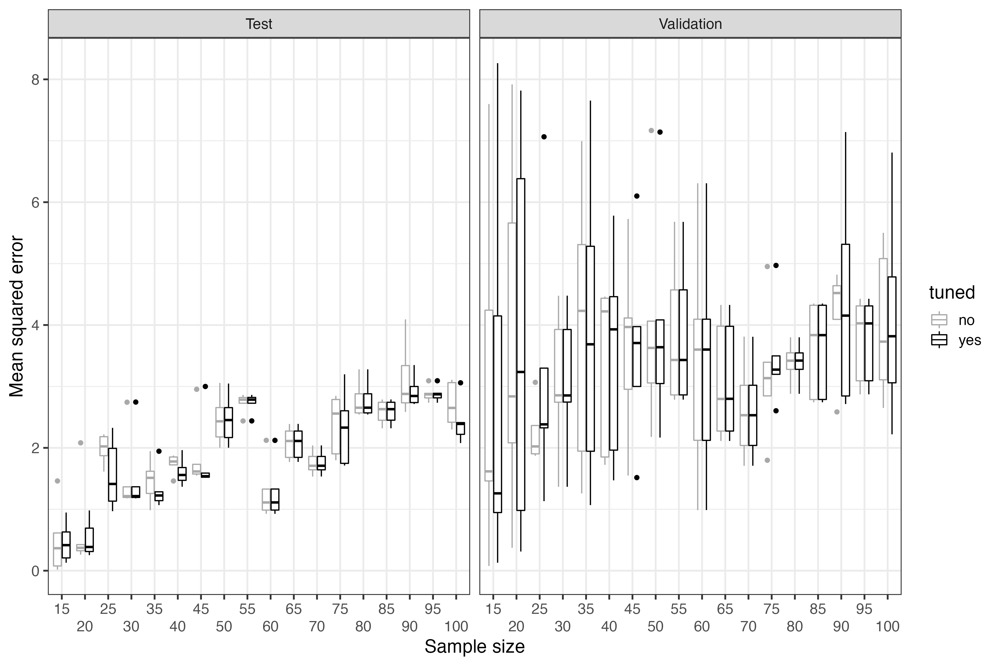

```{r setup, include = FALSE}
knitr::opts_chunk$set(echo = TRUE)
```

# B1 R code underlying appendix C

Appendix C is meant to serve as a bridge that connects the minimalist demonstration of supervised machine learning (sML) in the manuscript with the exemplary real-world sML analyses in this supplementary demoSML R package.

In this supplementary appendix C material, we copied the same sML procedure from the manuscript (where 5 observations were used), and added two important aspects:

1. Increase the sample size.

2. Standardize (z-transform) the predictor.

We did not standardize the predictor values in the manuscript, because it would have complicated the straight forward demonstration of the sML *principles* unnecessarily. That is, nothing would have been gained, at the cost of an additional cognitive challenge. This challenge is better placed in this vignette (see below).

Standardization transforms a numerical variable, e.g., predictor values, so that after transformation its mean is zero and its standard deviation is one. This is done very often in sML (e.g., Singh and Singh, 2020).

Standardization: The mean of the original values is subtracted from each original value in the variable, and divided by the standard deviation of the original values.

### Small standardization example
Original values of a variable be: 5, 6, 7, 8. Mean = 6.5. Standard deviation (sd) = 1.29.
```{r echo=TRUE, eval=FALSE}
values <- c(5, 6, 7, 8)
# Compute standardized values manually
(values - mean(values))/sd(values)
# Output
[1] -1.1618950 -0.3872983  0.3872983  1.1618950

# Compute standardized values with R function scale()
scale(values) # mean = 6.5, sd = 1.290994
# Output
           [,1]
[1,] -1.1618950
[2,] -0.3872983
[3,]  0.3872983
[4,]  1.1618950
attr(,"scaled:center")
[1] 6.5
attr(,"scaled:scale")
[1] 1.290994

# Confirm that the transformed values have mean = 0 and sd = 1
mean(scale(values)) # mean = 0
# Output
[1] 0

sd(scale(values)) # sd = 1
# Output
[1] 1
```

## Standardization (z-transformation) of predictor(s) in sML
Maybe the most frequently stated reason to standardize predictors in sML is to prevent that any predictor is preferred by the algorithm over other predictors, only due to its scale properties, e.g., a wider range of values than that of other predictors. A lower prediction performance can also result from not standardizing predictors (Nkikabahizi et al., 2022).

In this supplementary appendix C material, we want to demonstrate how the sML research logic manifests itself when standardizing the predictor values. Since sML aims to accurately predict *new* outcome values on the individual level, 
and because *tuning* often is a routine part of the whole sML procedure, standardizing predictor values manifests itself accordingly:

* Standardize predictor(s) in the *training subset*.
* In both, the *test subset* and the *validation subset*, standardize the predictor values, respectively, by using the mean and standard deviation of the *training subset*.

As we mentioned in the manuscript, sML research must attempt to simulate the real-world implementation of a prediction algorithm as closely as possible. This is expressed in the use of the mean and standard deviation only from the *training subset*, since only the training data will be known, prior to implementing an algorithm in a real-world setting.

### Small sML standardization example
For this small example we just use a training and a test subset (no validation subset).
```{r echo=TRUE, eval=FALSE}
trainingValues <- c(5, 6, 7, 8)
# Save mean of trainingValues (6.5)
trainingMean <- mean(trainingValues)
# Save sd of trainingValues (1.290994)
trainingSD <- sd(trainingValues)
testValues <- c(6, 7, 8)
# Scale the test values according to mean and sd of the training values
(testValuesScaled <- scale(testValues, center = trainingMean, scale = trainingSD))
# Output
           [,1]
[1,] -0.3872983
[2,]  0.3872983
[3,]  1.1618950
attr(,"scaled:center")
[1] 6.5
attr(,"scaled:scale")
[1] 1.290994
# Unless training and test values are exactly alike, test mean is not 0, test sd is not 1, after standardization.
mean(testValuesScaled)
# Output
[1] 0.3872983
sd(testValuesScaled)
# Output
[1] 0.7745967
```

## Appendix C function **myDemoSML1**.
Note that the value 1 (in myDemoSML1) only shows that the function is not exactly the same as the function myDemoSML in the vignette 'B.0 R code that underlay the manuscript and appendices A and B'. However, the sML procedure is exactly the same. That is, in the manuscript and appendix B (*N* = 5 observations) 60% of the total sample was used for training (3 observations), while 20% (1 observation) was held out for the test and the validation performance, respectively.
In this supplementary appendix C material, only two things changed:

* Instead of 5 observations, we used 18 different sample sizes, starting at 15, ending at 100, each time adding 5 observations to the previous sample size. Therefore, each test and validation subset consisted of more than 1 single observation.
* Instead of the squared residual error of 1 test and 1 validation individual, we now use the mean squared residual error (mse), because the test and validation subsets consist of more than 1 single observation. That is, 'summarizing' a single individual's prediction error is not possible, whereas for a group of individuals the prediction error must be summarized to evaluate a model's prediction performance.

The data simulation function **makeData** is the only function that is embedded in the **demoSML** R package. This means that it can be used right away and that it is documented. Just enter ?makeData in the R console, after the demoSML package has been installed and loaded.

Name of the function: **myDemoSML1**. The function contains 3 arguments:

* data: data set to be given to the function. The data set must contain a data set with a continuous predictor (column name must be x) and a continuous outcome (column name must be y). Furthermore, the sample size must be greater than and a multiple of 5.
* tune: the value that shall be added to the linear model's regression weight after model fitting; default is NULL, which means 'no tuning'.
* seed: a single integer value, e.g., 1, which will be used for splitting the total sample size into five subsets. A seed guarantees reproducibility of the results of the simulated data sets.

Note. In the code chunk below the words training (sML step 4), testing (sML step 5), and validating (sML step 6) are emphasized (capital letters with a whitespace between them). Furthermore, see the detailed description of the results of the demoSML function in the vignette 'B0: R code underlying the manuscript and appendices A and B' (table of contents: Table 3 (left part, without tuning)). The output structure of both, the demoSML and the demoSML1 function, is identical.
```{r echo=TRUE, eval=FALSE}
# Install and load the demoSML package, using the devtools package:
install.packages("devtools")
# Load the devtools package
library(devtools)
# Install the demoSML package from GitHub
devtools::install_github(repo = "https://github.com/mmiche/demoSML",
                         dependencies = "Imports"))
# Load the demoSML package
library(demoSML)
# Demand to see the package documentation, part of which are the links to all the package vignettes.
help(package="demoSML")

# Demand to see the documentation for the function 'makeData':
# Enter in the R console
?demoSML::makeData

# Function myDemoSML1
myDemoSML1 <- function(data=NULL, tune=NULL, seed=NULL) {
    # Explain abbreviations:
    # mse: mean squared error (= mean of residual sum of squared errors)
    # V = Validation subset; Te = Test subset
    # TeLost = 3 other test cases that did not win
    # mseTr = mse of training subset
    # coefs = Intercept and regression weight of each of the
    # 20 models (5 outer loops times 4 inner loops = 20).
    # idxBest: Collect the best among the 4 test performances.
    # Remember: Test performance occurs in the inner loop.
    mseV <- mseTe <- mseTeLost <- mseTr <- coefs <- idxBest <- c()
    
    # Complement to idxBest (per 4 test performances: 1 win, 3 losses)
    idxLostLs <- list()
    
    # Split total sample into 5 subsets of equal size:
    idxSplit5 <- rep(1:5, each=nrow(data)/5)
    # Set a predefined seed (ensure reproducibility)
    set.seed(seed)
    # Generate random assignment to one of the 5 subsets
    idx_i <- sample(idxSplit5)
    
    for(i in 1:5) {

        # Select the validation subset
        # (hold-out until final performance estimation is due)
        validationRows <- which(idx_i==i)
        
        # vd: validation sample (one fifth of total sample)
        vd <- ds[validationRows,]
        # ttd: training and test sample (four fifths of total sample)
        ttd <- ds[-validationRows,]
        
        # mse_j: mean squared error across the 4 test subsets.
        mse_j <- c()
        # List with which to collect the linear model coefficients.
        lms <- list()
        
        # mnSdLs: List with which to collect the mean and the standard
        # deviation of the predictor values in the training subset.
        mnSdLs <- list()
        
        # For the training and subsequent test session, use all indices
        # of idx_i, except for the held-out validation subset.
        idx_j <- idx_i[idx_i!=i]
        
        # trainingSequence: A variable that will increase from 1 to 4
        # within each training session.
        trainingSequence <- 1
        # Inner loop
        # (4 training sessions for each of the 5 outer loops)
        for(j in sort(unique(idx_j))) {
            
            # Set the training subset (three fifths of the total sample)
            trainingRows <- which(idx_j!=j)
            
            # Set the test subset (one fifth of the total sample)
            testRows <- which(idx_j==j)
            
            # td: training data
            td <- ttd[-testRows,]
            
            # mean and sd of td (collect in the list mnSdLs)
            mnSdLs[[trainingSequence]] <- c(mean(td$x), sd(td$x))
            
            # scale td
            td <- data.frame(x=scale(td$x),
                             y=td$y)
            
            # T R A I N I N G
            # lmj: linear model in loop number j
            lmj <- lm(y ~ x, data = td)
            
            # Nudge the regression weight a bit?
            if(!is.null(tune)) {
                # T U N I N G
                # Execute the dummy tuning
                lmj$coefficients[2] <- lmj$coefficients[2] + tune
            }
            
            # Add the fitted linear model to the list
            lms[[trainingSequence]] <- lmj
            
            # Fit the training model to the training sample
            # Sometimes called: Apparent prediction performance
            ftr <- predict(lmj, newdata=td)
            # sqrdTrThreeObs: squared residuals of the training subset.
            sqrdTrThreeObs <- (td[,"y"]-ftr)**2
            # mse of training subset
            mseTr <- c(mseTr, sum(sqrdTrThreeObs)/length(sqrdTrThreeObs))
            
            # T E S T I N G
            
            # z-transform test data, using the training data mean and sd
            # ---------------------
            ttd.z <- data.frame(
                x=scale(ttd[testRows,"x"],
                        center = mnSdLs[[trainingSequence]][1],
                        scale = mnSdLs[[trainingSequence]][2]),
                y=ttd[testRows,"y"])
            
            # Fit the training model to the test sample (one fifth of total sample)
            ft <- predict(lmj, newdata=ttd.z)
            # Collect the test prediction performance result.
            mse_j <- c(mse_j, sum(((ttd.z[,"y"]-ft)**2))/length(ft))
            
            # Increase training session counter by 1
            trainingSequence <- trainingSequence + 1
        }
        # After each inner loop (4 iterations), collect the
        # intercept and the regression weight of the fitted
        # linear models.
        coefs <- c(coefs, unlist(lapply(lms, FUN = function(x) {
            as.numeric(coefficients(x))
        })))
        
        # Which training session yielded the best test performance?
        # That is, which had the minimum mean squared prediction error?
        idxBest_i <- which(mse_j == min(mse_j))
        # Collect the winner after each inner loop.
        # idxBest includes the index of the winning model, that is
        # a value between 1 and 4.
        idxBest <- c(idxBest, idxBest_i)
        # Collect the best test prediction performance estimate.
        # Best performance = smallest mean squared prediction error.
        mseTe <- c(mseTe, mse_j[idxBest_i])
        # Collect the remaining test prediction performance estimates.
        # Always three mean squared prediction errors, the ones that were
        # not the smallest of the four mean squared prediction errors.
        mseTeLost <- c(mseTeLost, mse_j[-idxBest_i])
        # Collect the indices of the 3 remaining test prediction performances.
        idxLostLs[[i]] <- which(mse_j > min(mse_j))
        
        # V A L I D A T I N G
        
        # z-transform validation data, using the training data mean and sd
        # ---------------------------
        vd.z <- data.frame(
            x=scale(vd[,"x"],
                    center = mnSdLs[[idxBest_i]][1],
                    scale = mnSdLs[[idxBest_i]][2]),
            y=vd$y)
        
        # ftv: Fit the best training model to the validation sample.
        ftv <- predict(lms[[idxBest_i]], newdata = vd.z)
        # Collect the final real-world prediction performance estimate.
        # V = validation subset
        mseV <- c(mseV, sum(((vd.z[,"y"]-ftv)**2))/length(ftv))
    }
    
    # Held-out validation subsets 1-5
    # (1 held-out subset for each of the 5 runs; runs = outer loop).
    Vcase <- 1:5
    # 3 loosing test performances per outer loop.
    # (Use as index vector in for-loop below)
    mseTeLostOrdIdx <- rep(1:5, each=3)
    
    # mseTeAll: Vector to collect all test performances,
    # i.e., 1 winning and 3 loosing performances per run.
    mseTeAll <- c()
    for(k in Vcase) {
        # mseTe.k: All 4 test performances
        mseTe.k <- c(mseTe[k], mseTeLost[mseTeLostOrdIdx==k])
        # Mixed-up order of all 4 test performances
        mseTe.kIdx <- c(idxBest[k], idxLostLs[[k]])
        # Generate correct order of all 4 test performances.
        mseTe.k <- mseTe.k[order(mseTe.kIdx)]
        # Collect all 4 test performances in their correct order.
        mseTeAll <- c(mseTeAll, mseTe.k)
    }
    # Repeat index of best test performance 4 times, i.e.,
    # 5 winning indices times 4 equals a vector of length 20.
    bestTest <- rep(as.numeric(idxBest), each=4)
    # Generate another vector of length 20, which contains 5
    # times the same increasing sequence 1, 2, 3, 4.
    idxBestTest <- rep(1:4, times=5)
    # By testing both vectors 'bestVec' and 'idxBestTest' for
    # equality (==), we obtain a logical vector, where TRUE
    # are the 5 winning performances across all 20 performances.
    # This logical vector is used in the detailed output below.
    bestValidation <- which(bestTest == idxBestTest)
    
    # perfAll: All 20 performances in detail.
    perfAll <- data.frame(Run=rep(1:5, each=4),
                          bestTest=idxBestTest,
                          mseTraining=mseTr,
                          mseTest=mseTeAll,
                          mseValidation=rep(mseV, each=4))
    # Here, the logical vector bestValidation is used. All
    # validation performances that were NOT best (per inner
    # loop), are set to NA.
    perfAll$mseValidation[-bestValidation] <- NA
    
    # Data set that shows test and validation performance,
    # and the gap of the mean squared residual error per run.
    testValidDf <- data.frame(mseTe, mseV, gap=mseV-mseTe)
    
    return(list(testValidDf=testValidDf,
                # coefsMat: col 1 = intercept, col 2 = x weight
                # Four rows for each of the five runs = 20 rows.
                # Each of the four rows represents four different
                # test performances, since one out of the remaining
                # four subsets is successively used as test subset.
                coefsMat=matrix(data = coefs, ncol=2, byrow = TRUE),
                # 3 loosing test performances per run.
                mseTeLost=matrix(mseTeLost, ncol=5),
                # 4 training performances per run.
                # (mse: mean squared error)
                mseTr=matrix(mseTr, ncol=5),
                # All 4 test performances (win and loose) per run.
                mseTeAll=matrix(mseTeAll, ncol=5),
                # All 20 performances in detail.
                perfAll=perfAll))
}
```

## Run 18 a-e cycles

In each a-e cycle, the total sample size will be assigned to the training subset (60%), the test subset (20%), and the validation subset (20%).
```{r echo=TRUE, eval=FALSE}
# testPerfNoTune: Empty vector with which to collect test performance results, without tuning.
# validPerfNoTune: Empty vector with which to collect validation performance results, without tuning.
# testPerfTune: Empty vector with which to collect test performance results, with tuning.
# validPerfTune: Empty vector with which to collect validation performance results, with tuning.
# tuneVec: Empty vector with which to collect the selected tuning values (range .001-1.0).
# nvec: Empty vector with which to collect the sample size of the respective performance results.
testPerfNoTune <- validPerfNoTune <- testPerfTune <- validPerfTune <- tuneVec <- nvec <- c()

# Set 18 different sample sizes: 15, 20, ..., 100
smps <- seq(15, 100, by=5)

# Start for-loop, one loop for each sample size.
for(n in smps) {
    # Print start to R console (shows that the loop started)
    print("loop start ...")
    
    # ds: data set with n many observations. Draw predictor and prediction error values from a normal distribution, the error values have a mean of zero and a standard deviation of 2. The functional form of the association is linear (intercept is set to 1, regression weight is set to 3); see figure 1C in appendix C of the main document.
    ds <- makeData(n=n, errSD = 2)
    
    # Collect current sample size
    nvec <- c(nvec, rep(n, times=5))

    # --------------------------
    # W I T H O U T  T U N I N G
    # One a-e cycle is initiated by using the function myDemoSML1, here: without tuning.
    lm1 <- myDemoSML1(data=ds, seed = 1)
    
    # Collect test and validation prediction performance (all 5 outer runs)
    testPerfNoTune <- c(testPerfNoTune, lm1$testValidDf[,1])
    validPerfNoTune <- c(validPerfNoTune, lm1$testValidDf[,2])
    
    # --------------------------
    # W I T H  T U N I N G
    # Experiment with 100 different tuning values, using a range between .001 and 1.
    tunerGrid <- seq(.001, 1, length.out=100)
    # meanPerf: Vector with which to collect the mean test performance of an a-e cycle, here: with tuning.
    meanPerf <- c()
    for(t in tunerGrid) {
        meanPerf <- c(meanPerf, colMeans(
            myDemoSML1(data=ds, seed = setSeed, tune=t)$testValidDf)[1])
    }
    # Put all 100 tuned test performances in a data.frame.
    tuneLin <- data.frame(x=1:length(tunerGrid), y=meanPerf, t=tunerGrid)
    # Select tuning value with the minimum test prediction error.
    linMin <- which(tuneLin$y == min(tuneLin$y))
    # Run again with the tuning value being set:
    lm2 <- myDemoSML1(data=ds, seed = setSeed,
                      tune = tuneLin[linMin,"t"])
    
    # Collect test and validation prediction performance (all 5 outer runs)
    testPerfTune <- c(testPerfTune, lm2$testValidDf[,1])
    validPerfTune <- c(validPerfTune, lm2$testValidDf[,2])
    
    # Collect the tuning value with which the best test performance was achieved.
    tuneVec <- c(tuneVec, tuneLin[linMin,"t"])
    # Print end to R console (shows that the loop finished)
    print(paste0("loop end. Sample size: ", n))
}
```

## Relevant results only (see figure 2C)

```{r echo=TRUE, eval=FALSE}
# df = data.frame, Box = boxplot
dfBox <- data.frame(testPerfNoTune, validPerfNoTune, testPerfTune, validPerfTune)
# Prepare dfBox for visualization in ggplot2
dfBox1 <- reshape2::melt(dfBox, measure.vars = names(dfBox))
# Add sample sizes to dfBox1
dfBox1$xax <- nvec
# Add the condition of the performance results (test versus validation)
dfBox1$condition <- rep(rep(c("Test", "Validation"), each=length(smps)*5), times=2)
# Add column that shows whether or not tuning took place
dfBox1$tuned <- rep(c("no", "yes"), each=length(nvec)*2)
# Transform column xax (x-axis) to the class factor (use the forcats R package)
dfBox1$xax <- forcats::as_factor(dfBox1$xax)
# Visualize results with boxplots, using the ggplot2 package
ggplot(data=dfBox1, aes(x=xax, y=value, color=tuned)) +
    geom_boxplot() +
    scale_color_manual(values=c("darkgray", "black")) +
    scale_x_discrete(guide = guide_axis(n.dodge = 2.5)) +
    xlab(label="Sample size") + ylab(label = "Mean squared error") +
    facet_wrap(~condition) +
    theme_bw(base_size = 16)
```

{width=800pt, height=500pt}

The boxplots show what is expected from dummy tuning: No improved prediction performance, compared to no dummy tuning. With increasing sample size, boxplots are very similar, often almost identical. The reason for the almost identical boxplots are easy to explain when looking at the selected tuning values (in the range between 0.001 and 1.0).

```{r echo=TRUE, eval=FALSE}
(tuneVecDf <- data.frame(smps, t=tuneVec))
# Output in console
   smps          t
1    15 0.25327273
2    20 0.46518182
3    25 0.98990909
4    30 0.00100000
5    35 0.27345455
6    40 0.48536364
7    45 0.48536364
8    50 0.01109091
9    55 0.00100000
10   60 0.00100000
11   65 0.00100000
12   70 0.00100000
13   75 0.30372727
14   80 0.00100000
15   85 0.00100000
16   90 0.90918182
17   95 0.00100000
18  100 0.49545455
```

The value 0.001 had been selected as best tuning value in 8 of the 18 different sample sizes, e.g., for a sample size (smps) of 30. This says that almost the same simple linear regression has been computed twice, since 0.001 is approximately 0 (adding almost 0 to the estimated regression weight). Therefore, the boxplots must be almost identical.

For selected tuning values in the mid-range, e.g., 0.485 for sample size 40 or 45, the tuned test performance appears a tiny bit better, compared to no tuning. However, the validation boxplots overlap almost completely between "tuning" and not tuning. The high-range tuning value of 0.909 for sample size 90, also is in line with the expected dummy behavior.

**References**

Nkikabahizi, C., Cheruiyot, W., & Kibe, A. (2022). Chaining Zscore and feature scaling methods to improve neural networks for classification. *Applied Soft Computing, 123*, 108908.

Singh, D., & Singh, B. (2020). Investigating the impact of data normalization on classification performance. *Applied Soft Computing, 97*, 105524.

Wickham H (2007). Reshaping Data with the reshape Package. *Journal of Statistical Software*, *21*(12), 1–20. [http://www.jstatsoft.org/v21/i12/](http://www.jstatsoft.org/v21/i12/).

Wickham H (2016). ggplot2: Elegant Graphics for Data Analysis. Springer-Verlag New York. ISBN 978-3-319-24277-4, [https://ggplot2.tidyverse.org](https://ggplot2.tidyverse.org).

Wickham H, Hester J, Chang W, Bryan J (2021). devtools: Tools to Make Developing R Packages Easier. R package version 2.4.3, [https://CRAN.R-project.org/package=devtools](https://CRAN.R-project.org/package=devtools).

Wilke CO (2020). cowplot: Streamlined Plot Theme and Plot Annotations for 'ggplot2'. R package version 1.1.1, [https://CRAN.R-project.org/package=cowplot](https://CRAN.R-project.org/package=cowplot).