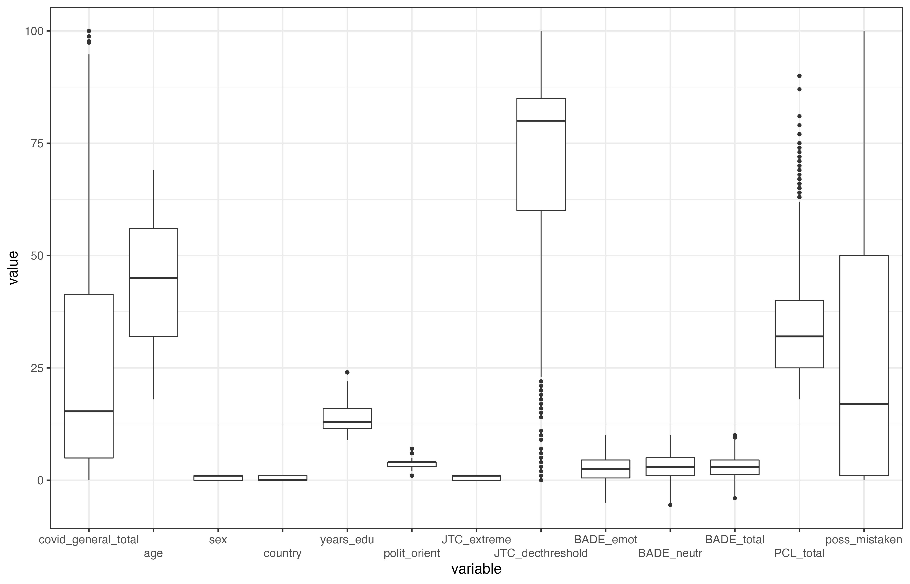
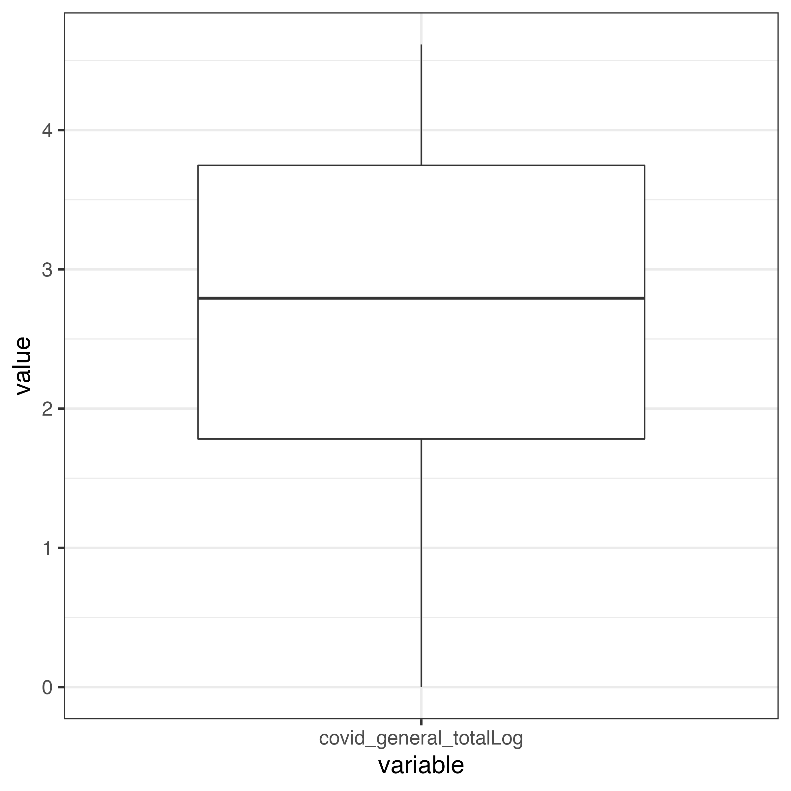
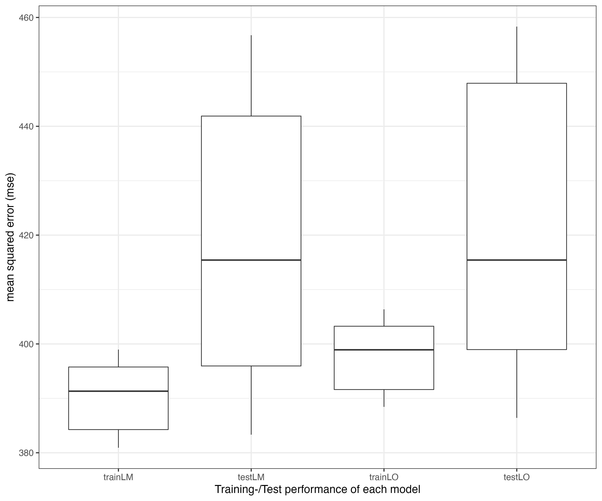

```{r setup, include = FALSE}
knitr::opts_chunk$set(echo = TRUE)
```

# C0: R code Kuhn et al. (2021) data set

> **Details regarding the outcome and the predictors (what they mean and their scales), see this demoSML documentation of the data set 'supplc'.**

New in this C0 vignette, compared to previous vignettes:

* Use of a real, as opposed to simulated, data set (open access data set; Kuhn et al., 2021)
* Use of 12 predictors, instead of just one.
* Use of an algorithm to compete against the conventional linear regression (no more competition of linear regression against itself)
* Competitor algorithm possesses a tuning parameter (no more dummy tuning)

## Load required R packages (install first, if not yet installed)
```{r echo=TRUE, eval = FALSE}
# car required to check multicollinearity
library(car)
# ggplot2 = visualizations
library(ggplot2)
# reshape2 = prepare data for ggplot2
library(reshape2)
# Enable use of lasso regression
library(glmnet)
library(glmnetUtils)
```

Required data set is loaded automatically, once this demoSML package has been loaded.

```{r echo=TRUE, eval = FALSE}
library(demoSML)
# Assign data set supplc to variable name d
d <- supplc
# Prepare data for visualization
dBox <- reshape2::melt(d, measure.vars = names(d))
# Display distribution with boxplots
ggplot(data=dBox, aes(x=variable, y=value)) + geom_boxplot() +
    theme_bw(base_size=16) +
    scale_x_discrete(guide = guide_axis(n.dodge = 2.5))
```

{width=500pt, height=400pt}

## Step 1: Preprocessing

The outcome is skewed towards small values. We might wish to change that by using the logarithm to transform the outcome. 

```{r echo=TRUE, eval = FALSE}
# Transform outcome values with logarithm, append it as new column to d.
d[,"covid_general_totalLog"] <- 
    # Addition of 1 to each original outcome value, otherwise the value 0 gets removed (log of 0 is not defined).
    log(d[,"covid_general_total"]+1)
```

The data set d has now 14 columns. The last column is the log-transformed outcome.

```{r echo=TRUE, eval = FALSE}
cbind(colnames(d))
      [,1]                    
 [1,] "covid_general_total"   
 [2,] "age"                   
 [3,] "sex"                   
 [4,] "country"               
 [5,] "years_edu"             
 [6,] "polit_orient"          
 [7,] "JTC_extreme"           
 [8,] "JTC_decthreshold"      
 [9,] "BADE_emot"             
[10,] "BADE_neutr"            
[11,] "BADE_total"            
[12,] "PCL_total"             
[13,] "poss_mistaken"         
[14,] "covid_general_totalLog"
```

{width=300pt, height=300pt}

Prepare to use both outcomes, one after the other, in order to finally compare whether the pattern of the final results differ from one another.

```{r echo=TRUE, eval = FALSE}
# Original outcome value
(analysis <- colnames(d)[-14])
# Log-transformed outcome values
(analysisLog <- colnames(d)[c(14,2:13)])
```

The variable 'analysis' contains the original outcome values as outcome, whereas the variable 'analysisLog' contains the log-transformed outcome values as outcome. Both, analysis and analysisLog contain the same 12 predictors.

### Check multicollinearity

For this C0 vignette, we intentionally included a predictor that is expected to be highly correlated with some of the other predictors (= multicollinearity). The predictor BADE_total contains two parts, which are represented in the two predictors BADE_emot (emotional) and BADE_neutr (neutral). We continue as if we did not know that.

```{r echo=TRUE, eval = FALSE}
# Check multicollinearity with car::vif (variance inflation factor)
# First, assign d to new variable, prevent confusion later on.
dvif <- d[,analysis]
```

The relevant part of the data set is copied to a new variable name: dvif (d = data set, vif = variance inflation factor). The original data set still exists.

```{r echo=TRUE, eval = FALSE}
# Setup the model formula for the linear regression model
(fmla <- formula(x=paste(analysis[1], "~", paste(analysis[-1], collapse = "+"))))
# Output
covid_general_total ~ age + sex + country + years_edu + polit_orient + 
    JTC_extreme + JTC_decthreshold + BADE_emot + BADE_neutr + 
    PCL_total + poss_mistaken
```

Compute the vif values.
```{r echo=TRUE, eval = FALSE}
# vif > 5 (or 10) are heuristics to assume the presence of multicollinearity
car::vif(lm(fmla, data = d))
Error in vif.default(lm(fmla, data = d)) : 
  there are aliased coefficients in the model
# Error message says that there is 'perfect multicollinearity' among the current predictors.
```

Perfect multicollinearity means that at least one of the predictors is a linear transformation of other predictors in the model. We find out which one that might be by using the correlation matrix, searching for particularly high correlations (larger than 0.8).

```{r echo=TRUE, eval = FALSE}
# Correlation matrix (without the log-transformed outcome, column 14)
corMat <- cor(d[,-14])
# Diagonal is irrelevant, therefore set to 0:
diag(corMat) <- 0
# Correlations > .8
cor.8 <- corMat > .8
# Display variable names
cbind(apply(cor.8, 1, function(x) any(x==TRUE)))
# Output
                     [,1]
covid_general_total FALSE
age                 FALSE
sex                 FALSE
country             FALSE
years_edu           FALSE
polit_orient        FALSE
JTC_extreme         FALSE
JTC_decthreshold    FALSE
BADE_emot            TRUE
BADE_neutr           TRUE
BADE_total           TRUE
PCL_total           FALSE
poss_mistaken       FALSE

# Display correlation matrix of the BADE variables:
cor(d[,c("BADE_total", "BADE_emot", "BADE_neutr")])
# Output
           BADE_total BADE_emot BADE_neutr
BADE_total  1.0000000 0.8036306  0.8381288
BADE_emot   0.8036306 1.0000000  0.3489199
BADE_neutr  0.8381288 0.3489199  1.0000000
```

We decide to remove the predictor BADE_total, then compute vif values.

```{r echo=TRUE, eval = FALSE}
# Remove BADE_total from model with original outcome values.
# Remove by ignoring index 11.
(analysis <- colnames(d)[c(1:10,12:13)])
# Remove BADE_total from model with log-tranformed outcome values.
# Remove by ignoring index 11.
(analysisLog <- colnames(d)[c(14,2:10,12:13)])
```

Compute the vif values, again. Show their range (minimum, maximum).
```{r echo=TRUE, eval = FALSE}
# Model formula (without BADE_total)
fmla <- formula(x=paste(analysis[1], "~", paste(analysis[-1], collapse = "+")))
# Range of vif values across all predictors (after removal of BADE_total)
range(car::vif(lm(fmla, data = d)))
# Output
1.010964 1.228467
```

Since vif values of 5 or higher are sometimes interpreted as indicative of multicollinearity, we proceed to the next step: model selection.

## Step 2: Model selection

We select the linear regression model and the lasso regression model (provided by the R package glmnet).

In the same way as in the B0 and B1 vignette, we set up our own custom functions, inside of which we put steps 3-6 of the sML procedure. We recommend to compare the code for the linear regression model with the **myDemoSML1** function in the B1 vignette (B1: R code for appendix C). It is almost the same, except that here the dummy tuning mechanism has been removed.

Furthermore, to keep things as simple as possible in this C0 vignette, we do not experiment with different tuning values in the lasso regression model. Instead we use one fixed tuning value, which we will determine empirically. But first, the custom function for the linear regression model:

```{r echo=TRUE, eval = FALSE}
# Function my.lm to run supervised ML procedure, using the linear regression model (lm).
my.lm <- function(d=NULL, f=NULL, seeds=NULL) {
    # Three vectors, with which to collect
    # the estimated model coefficients (intercept
    # and regression weights), and the training
    # and test subset mean squared error (mse).
    coefs <- mseTrain <- mseTest <- c()
    # Two lists, with which to collect the detailed
    # training and test predictions of the linear
    # prediction model.
    trainDetail <- testDetail <- list()
    for(i in 1:length(seeds)) {
        # T R A I N I N G
        # Training data set for iteration i
        set.seed(seeds[i])
        trainIdx <- sample(nrow(d), .8*nrow(d))
        train_i <- d[trainIdx,]
        # Compute mean of all columns.
        mean_i <- colMeans(train_i)
        # Compute standard deviation of all columns.
        sd_i <- apply(train_i, MARGIN = 2, FUN = sd)
        # z-transform all columns in training data.
        train_i_z <- data.frame(scale(train_i))
        # Re-insert the original outcome values.
        train_i_z[,1] <- d[trainIdx,1]
        # Train/develop the model by the training data.
        mod <- lm(f, data=train_i_z)
        # Estimated model coefficients
        coefs <- c(coefs, mod$coefficients)
        # Collect the mean squared error (mse) within the training data.
        mseTrain <- c(mseTrain, mean(mod$residuals**2))
        # Collect the detailed training predictions.
        trainDetail[[i]] <- data.frame(actual=d[trainIdx,1],
                                       fitted=as.numeric(mod$fitted),
                                       itrn=i)
        # T E S T  (V A L I D A T I N G)
        testIdx <- (1:nrow(d))[-trainIdx]
        # z-transformed test data set for iteration i, use mean and sd from training
        test_i_z <- data.frame(scale(d[testIdx,], center = mean_i, scale = sd_i))
        # Re-insert the original outcome values.
        test_i_z[,1] <- d[testIdx,1]
        # Test/evaluate model = Apply training model to holdout test subset.
        # fitted = predicted outcome values in test data set.
        fittedTest <- predict(mod, newdata=test_i_z)
        # Residuals in test data
        rsdlTest <- as.numeric(test_i_z[,1] - fittedTest)
        # Save mean squared error (mse) within the test data.
        mseTest <- c(mseTest, mean(rsdlTest**2))
        # Collect the detailed test predictions.
        testDetail[[i]] <- data.frame(actual=d[testIdx,1],
                                      fitted=as.numeric(fittedTest),
                                      itrn=i)
    }
    # Output returned to the user.
    return(list(
        # MSE in the training subset (apparent performance).
        mseTrain=mseTrain,
        # MSE in the test subset (validation performance).
        mseTest=mseTest,
        # Estimated model coefficients.
        coefs=coefs,
        # Detailed overview of prediction performance in the training subset.
        trainDetail=trainDetail,
        # Detailed overview of prediction performance in the test subset.
        testDetail=testDetail))
}
```

Next, the custom function for the lasso regression model. Lasso stands for 'least absolute shrinkage and selection operator'. Lasso can shrink regression weights (= tuning). The tuning parameter is called 'lambda'. Larger lambda values shrink the coefficients stronger than small lambda values. The special part about lasso is that it can automatically select a subset of the predictors from all predictors in the model, by shrinking coefficients to zero (= throwing them out of the model).

In other words, lasso can be used to achieve (almost) the same or even a better prediction performance than the linear regression model, by using only the predictors in the model that sufficiently contribute to the overall prediction performance. The linear regression model must carry all predictors that the user puts into the model, no matter how useless some of them may be for predicting the outcome.

The custom function for the lasso regression model:
```{r echo=TRUE, eval = FALSE}
# Function my.lasso to run supervised ML procedure, using the lasso regression model.
my.lasso <- function(d=NULL, s=NULL, seeds=NULL) {
    # Three vectors, with which to collect
    # the estimated model coefficients (intercept
    # and regression weights), and the training
    # and test subset mean squared error (mse).
    lassoCoefs <- mseTrain <- mseTest <- c()
    # Two lists, with which to collect the detailed
    # training and test predictions of the linear
    # prediction model.
    trainDetail <- testDetail <- list()
    for(i in 1:length(seeds)) {
        # ---------------
        # T R A I N I N G
        set.seed(seeds[i])
        trainIdx <- sample(nrow(d), .8*nrow(d))
        # Extract the training data, only the predictors.
        train_i <- d[trainIdx,-1]
        # Compute mean of all predictors.
        mean_i <- colMeans(train_i)
        # Compute standard deviation of all predictors.
        sd_i <- apply(train_i, MARGIN = 2, FUN = sd)
        # z-transform all predictors in training data.
        train_i_z <- scale(train_i)
        # Train/develop the model with the training data.
        set.seed(12345)
        mod <- glmnet(x=train_i_z,
                      # Outcome values are not z-transformed.
                      y=d[trainIdx,1],
                      # gaussian = regression, alpha = 1 = lasso.
                      family="gaussian", alpha=1)
        # Estimated model coefficients for lambda value of s,
        # e.g., s = 1.
        lassoCoefs <- c(lassoCoefs, as.numeric(coef(mod, s = s)))
        # Fit the model to the training data (obtain apparent performance)
        fittedTrain <- predict(mod, newx = train_i_z, s = s)
        # Compute residuals (prediction errors)
        rsdlTrain <- d[trainIdx,1] - fittedTrain
        # Save the mean squared error (mse) within the training data.
        mseTrain <- c(mseTrain, mean(rsdlTrain**2))
        # Collect the detailed training predictions.
        trainDetail[[i]] <- data.frame(actual=d[trainIdx,1],
                                       fitted=as.numeric(fittedTrain),
                                       itrn=i)
        # ------------------------------
        # T E S T  (V A L I D A T I N G)
        # z-transformed test data set for iteration i, use mean and sd from training.     
        testIdx <- (1:nrow(d))[-trainIdx]
        test_i_z <- scale(d[testIdx,-1], center = mean_i, scale = sd_i)
        # Test/evaluate model = Apply training model to holdout test subset.
        # fitted = predicted outcome values in test data set.
        fittedTest <- predict(mod, newx=test_i_z, s = s)
        # Residuals in test data
        rsdlTest <- d[testIdx,1] - fittedTest
        # Save mean squared error (mse) within the test data.
        mseTest <- c(mseTest, mean(rsdlTest**2))
        # Collect the detailed test predictions.
        testDetail[[i]] <- data.frame(actual=d[testIdx,1],
                                      fitted=as.numeric(fittedTest),
                                      itrn=i)
    }
    # Output returned to the user.
    return(list(
        # MSE in the training subset (apparent performance).
        mseTrain=mseTrain,
        # MSE in the test subset (validation performance).
        mseTest=mseTest,
        # Estimated model coefficients.
        lassoCoefs=lassoCoefs,
        # Detailed overview of prediction performance in the training subset.
        trainDetail=trainDetail,
        # Detailed overview of prediction performance in the test subset.
        testDetail=testDetail))
}
```

## Steps 3-6: Tuning, training, testing, and evaluating

Since we decided in this C0 vignette to not experiment with different tuning values, we split the total sample (*N* = 1597) only into two parts, a training (80% of the total sample) and a test subset (20% of the total sample). Using a single tuning value in the lasso model (instead of experimenting with different tuning values) means that we need to run the lasso model just once (one training session with the fixed tuning value). After that, the trained model will be evaluated with the test subset (which **in this sML scenario already is the subset for the final performance evaluation**).

Therefore, in this C0 vignette, the sML step 6 does not need to take place, making step 5 being the final step.

## Step 3: Tuning

First, let us empirically determine the tuning value (in the lasso model the tuning parameter is called lambda):

```{r echo=TRUE, eval = FALSE}
# Guarantee to replicate results by using set.seed.
set.seed(1)
mod_cv <- glmnet::cv.glmnet(
    x=scale(d[,analysis[-1]]),
    y=d[,analysis[1]], family='gaussian',
    alpha=1, nfolds = 10)
(min1se <- c(mod_cv$lambda.min, mod_cv$lambda.1se))
# Output
0.3071396 1.9743156

mean(min1se)
# Output
1.140728
```

The cv.glmnet function returns the minimal lambda value (lambda.min), which achieved the minimum cross-validated prediction error. It also returns a larger lambda value (lambda.1se) that was within one standard error of lambda.min. For this demonstration, we selected the mean of these two values as the fixed, empirically determined, lambda value for the lasso regression model.

Next, we run steps 4 and 5, starting with the linear regression model. But first, we set up 10 arbitrary values for the set.seed command (to guarantee that the results can be reproduced every time this code will be run).
```{r echo=TRUE, eval = FALSE}
# 10 arbitrary seeds, to demonstrate 10 sML runs which are guaranteed to be reproducible.
seeds <- c(24388, 59521, 43307, 69586, 11571,
           25173, 32618, 13903, 8229, 25305)
```

## Steps 4 and 5 (training and final test performance evaluation)

Run the linear regression model 10 times:
```{r echo=TRUE, eval = FALSE}
# Linear regression
lmRes <- my.lm(d=d[,analysis], f=fmla, seeds = seeds)
```

Then the lasso regression model, setting the tuning value lambda to 1.1. See the documentation of the glmnet R package: The function argument 's' is used to select a specific lambda value.
```{r echo=TRUE, eval = FALSE}
# Using a single fixed lambda tuning parameter of 1.1 in all 10 different runs.
lassoRes <- my.lasso(d=d[,analysis], s=1.1, seeds = seeds)
```

Display the results of both algorithms.
```{r echo=TRUE, eval = FALSE}
# Comparison between lm and lasso, of performances in training and test subsets.
(lm.lasso.Df1 <- data.frame(trainLM=lmRes$mseTrain,
                           testLM=lmRes$mseTest,
                           trainLO=lassoRes$mseTrain,
                           testLO=lassoRes$mseTest))
# Output
    trainLM   testLM  trainLO   testLO
1  390.9892 416.6534 398.5033 416.0374
2  380.9190 456.7386 388.4370 458.3217
3  395.7678 394.8990 403.1938 392.7143
4  397.6245 389.0075 404.6908 397.7975
5  391.6454 414.1738 399.3375 414.7999
6  398.9630 383.3298 406.3591 386.4126
7  395.7425 399.1159 403.2739 402.4591
8  388.2609 426.4046 395.1203 426.0281
9  382.9265 447.0375 390.4505 456.7870
10 381.7515 451.1563 389.2311 455.2052

# Overall mean performance across all 10 different runs.
colMeans(lm.lasso.Df1)
 trainLM   testLM  trainLO   testLO 
390.4590 417.8517 397.8597 420.6563

# Prepare data to be displayed with boxplots (reshape2 package required)
lm.lasso.Df1Box <- reshape2::melt(lm.lasso.Df1, measure.vars = names(lm.lasso.Df1))
# Visualize results (ggplot2 package required)
ggplot(data=lm.lasso.Df1Box, aes(x=variable, y=value)) + geom_boxplot() +
    theme_bw(base_size=16) +
    ylab(label="mean squared error (mse)") +
    xlab(label="Training-/Test performance of each model")
```

Display results across the 10 runs in a boxplot.

{width=500pt, height=400pt}


At first glance, it seems that the lasso model (testLO) performs slightly worse than the linear model (testLM): 420 is greater than 417 (larger prediction error is worse than lower prediction error). However, we mentioned above that lasso may achieve (almost) the same (or a better) prediction performance, after having thrown out some of the predictors. Let us see whether some of the predictor weights were shrunken to zero:
```{r echo=TRUE, eval = FALSE}
coefLO <- matrix(data=lassoRes$lassoCoefs, nrow=length(analysis))
rownames(coefLO) <- c("Intercept", analysis[-1])
round(coefLO, digits=2)
# Output (rounded to 2 digits)
                  [,1]  [,2]  [,3]  [,4]  [,5]  [,6]  [,7]  [,8]  [,9] [,10]
Intercept        24.27 24.04 24.54 24.51 24.45 24.70 23.79 24.08 24.41 24.30
age               0.00  0.00  0.00  0.00  0.00  0.00  0.00  0.00  0.00  0.00
sex               0.43  0.14  0.53  0.02  0.22  0.25  0.57  0.67  0.26  0.16
country           0.00  0.00  0.00  0.00  0.00  0.00  0.00  0.00  0.00  0.00
years_edu        -2.30 -1.54 -1.65 -2.13 -1.25 -1.79 -2.27 -1.73 -1.55 -1.62
polit_orient      2.63  2.63  2.83  2.61  2.82  2.74  2.15  2.63  2.67  2.56
JTC_extreme       1.80  1.73  1.48  1.19  1.91  1.86  1.34  1.72  1.79  1.33
JTC_decthreshold -0.92 -0.89 -0.83 -1.39 -0.86 -0.66 -0.94 -0.98 -0.60 -0.85
BADE_emot         0.00  0.00  0.00  0.00  0.00 -0.05  0.00  0.00 -0.07 -0.22
BADE_neutr        0.00  0.00  0.00  0.00  0.00  0.00  0.00  0.00  0.00  0.00
PCL_total         6.52  7.08  7.13  6.69  7.03  7.21  7.14  7.01  6.98  7.04
poss_mistaken     3.95  4.28  4.36  3.92  4.18  3.93  3.79  3.88  3.61  4.53
```
The predictors age, country, and BADE_neutr were thrown out all 10 times by the lasso regression model (lambda = 1.1). BADE_emot was thrown out 8 out of 10 times.

Using the lasso regression model might be preferred over the linear regression model, because by saving the resources (time and money) to measure BADE_emot and BADE_neutr for each new individual, we might still achieve almost the same prediction performance.

## Steps 3-5, using the log-transformed outcome values

Empirically determine the tuning value (lambda):

```{r echo=TRUE, eval = FALSE}
# Guarantee to replicate results by using set.seed.
set.seed(1)
mod_cvLog <- glmnet::cv.glmnet(
    x=scale(d[,analysisLog[-1]]),
    y=d[,analysisLog[1]], family='gaussian',
    alpha=1, nfolds = 10)
(min1seLog <- c(mod_cvLog$lambda.min, mod_cvLog$lambda.1se))
# Output
0.01787216 0.08690521

mean(min1seLog)
# Output
0.05238868
```

Run the linear regression model 10 times:
```{r echo=TRUE, eval = FALSE}
# Set up the model formula for covid_general_totalLog
fmlaLog <- formula(x=paste(analysisLog[1], "~", paste(analysisLog[-1], collapse = "+")))
# Linear regression
lmResLog <- my.lm(d=d[,analysisLog], f=fmlaLog, seeds = seeds)
```

Then the lasso regression model, setting the tuning value (lambda) to 0.05.
```{r echo=TRUE, eval = FALSE}
# Using a single fixed lambda tuning parameter of 0.05 in all 10 different runs.
lassoResLog <- my.lasso(d=d[,analysisLog], s=0.05, seeds = seeds)
```

Collect and display the results of both algorithms
```{r echo=TRUE, eval = FALSE}
# Comparison between lm and lasso, of performances in training and test subsets.
(lm.lasso.Df1Log <- data.frame(trainLM=lmResLog$mseTrain,
                           testLM=lmResLog$mseTest,
                           trainLO=lassoResLog$mseTrain,
                           testLO=lassoResLog$mseTest))
# Output
     trainLM    testLM   trainLO    testLO
1  0.9917213 1.1075932 1.0056625 1.1077531
2  0.9780461 1.1659580 0.9954736 1.1574328
3  1.0165080 0.9999379 1.0312742 1.0087489
4  1.0265378 0.9637984 1.0413081 1.0019392
5  0.9868930 1.1283982 1.0031645 1.1345365
6  1.0067468 1.0434269 1.0210570 1.0675393
7  1.0232596 0.9863725 1.0383621 0.9912731
8  1.0133370 1.0150981 1.0287240 1.0115551
9  1.0043048 1.0531364 1.0197311 1.0554096
10 0.9755114 1.1656848 0.9901527 1.1780143

# Overall mean performance across all 10 different runs.
colMeans(lm.lasso.Df1Log)
 trainLM   testLM  trainLO   testLO 
1.002287 1.062940 1.017491 1.071420
```

The pattern in the results is the same, when using the original outcome values or the log-transformed outcome values. The lasso model (LO) performs almost as good (1.07) as the linear model (LM; 1.06).

Let us see whether the predictors age, country, and BADE_neutr have been thrown out 10 out of 10 times, as was the case when using the original outcome values.

```{r echo=TRUE, eval = FALSE}
coefLog <- matrix(data=lassoResLog$lassoCoefs, nrow=length(analysisLog))
rownames(coefLog) <- c("Intercept", analysisLog[-1])
round(coefLog, digits=2)
# Output (rounded to 2 digits)
                  [,1]  [,2]  [,3]  [,4]  [,5]  [,6]  [,7]  [,8]  [,9] [,10]
Intercept         2.67  2.66  2.68  2.68  2.69  2.69  2.64  2.66  2.69  2.68
age               0.00  0.00  0.00  0.00  0.00  0.00  0.00  0.00  0.00  0.00
sex               0.05  0.05  0.07  0.04  0.06  0.06  0.08  0.08  0.07  0.05
country           0.00  0.00  0.00  0.00  0.01  0.00  0.00  0.00  0.00  0.00
years_edu        -0.10 -0.06 -0.07 -0.09 -0.05 -0.07 -0.08 -0.08 -0.07 -0.07
polit_orient      0.15  0.16  0.16  0.14  0.17  0.17  0.14  0.16  0.17  0.16
JTC_extreme       0.09  0.09  0.07  0.06  0.09  0.09  0.08  0.10  0.09  0.08
JTC_decthreshold -0.08 -0.07 -0.05 -0.07 -0.06 -0.05 -0.07 -0.07 -0.05 -0.05
BADE_emot         0.00  0.00  0.00  0.00  0.00  0.00  0.00  0.00  0.00  0.00
BADE_neutr        0.00  0.00  0.00  0.00  0.00  0.00  0.00  0.00  0.00  0.00
PCL_total         0.33  0.33  0.34  0.32  0.33  0.34  0.35  0.33  0.34  0.34
poss_mistaken     0.21  0.24  0.24  0.22  0.23  0.20  0.20  0.21  0.20  0.25
```

When using the log-transformed outcome values, the lasso model throws out age, country, BADE_neutr, and BADE_emot 10 out of 10 times.

**Conclusion**

The lasso regression model achieves almost the same prediction performance as the linear regression model, but needs four predictors less to do so.

# Fit model to the full data set (like in inferential statistics)

Use original outcome values in linear regression model
```{r echo=TRUE, eval = FALSE}
summary(lm(formula=fmla, data = d))
# Output
Residuals:
    Min      1Q  Median      3Q     Max 
-58.514 -13.538  -3.976  10.368  80.779 

Coefficients:
                 Estimate Std. Error t value Pr(>|t|)    
(Intercept)      -5.16346    4.74565  -1.088 0.276742    
age               0.01389    0.03641   0.382 0.702845    
sex               3.53410    1.02923   3.434 0.000611 ***
country           0.24462    1.07195   0.228 0.819520    
years_edu        -0.75922    0.16914  -4.489 7.68e-06 ***
polit_orient      3.31597    0.48840   6.789 1.59e-11 ***
JTC_extreme       5.13225    1.11966   4.584 4.92e-06 ***
JTC_decthreshold -0.07042    0.02533  -2.780 0.005504 ** 
BADE_emot        -0.28563    0.19593  -1.458 0.145080    
BADE_neutr        0.10201    0.17992   0.567 0.570834    
PCL_total         0.63875    0.04554  14.025  < 2e-16 ***
poss_mistaken     0.14946    0.01600   9.343  < 2e-16 ***
---
Signif. codes:  0 ‘***’ 0.001 ‘**’ 0.01 ‘*’ 0.05 ‘.’ 0.1 ‘ ’ 1

Residual standard error: 19.95 on 1585 degrees of freedom
Multiple R-squared:  0.2793,	Adjusted R-squared:  0.2743 
F-statistic: 55.83 on 11 and 1585 DF,  p-value: < 2.2e-16
```

Use log-transformed outcome values
```{r echo=TRUE, eval = FALSE}
summary(lm(formula=fmlaLog, data = d))
# Output
Residuals:
    Min      1Q  Median      3Q     Max 
-3.4467 -0.6655  0.0974  0.7235  2.5089 

Coefficients:
                   Estimate Std. Error t value Pr(>|t|)    
(Intercept)       1.1714638  0.2401873   4.877 1.18e-06 ***
age              -0.0013125  0.0018430  -0.712 0.476457    
sex               0.2537315  0.0520916   4.871 1.22e-06 ***
country           0.0494771  0.0542538   0.912 0.361931    
years_edu        -0.0341621  0.0085606  -3.991 6.89e-05 ***
polit_orient      0.1930393  0.0247189   7.809 1.04e-14 ***
JTC_extreme       0.2719128  0.0566683   4.798 1.75e-06 ***
JTC_decthreshold -0.0043606  0.0012821  -3.401 0.000688 ***
BADE_emot        -0.0028372  0.0099162  -0.286 0.774828    
BADE_neutr        0.0006862  0.0091062   0.075 0.939942    
PCL_total         0.0300494  0.0023050  13.037  < 2e-16 ***
poss_mistaken     0.0078370  0.0008096   9.680  < 2e-16 ***
---
Signif. codes:  0 ‘***’ 0.001 ‘**’ 0.01 ‘*’ 0.05 ‘.’ 0.1 ‘ ’ 1

Residual standard error: 1.01 on 1585 degrees of freedom
Multiple R-squared:  0.2788,	Adjusted R-squared:  0.2738 
F-statistic: 55.69 on 11 and 1585 DF,  p-value: < 2.2e-16
```

**Conclusion**

Explained variance of the outcome of approximately 28% shows that other important predictors may exist that were not part of the current predictor set. This is important information regarding the improvement of the current prediction model.

Notably, the used data set (Kuhn et al., 2021) is based on a cross-sectional study design. In order to 'predict' an outcome, longitudinal study designs are preferred, where predictors were measured prior to the outcome. For instance, if the outcome is a mental disorder, the predictors of the study baseline are often used to predict the first lifetime development of the mental disorder at follow up. (Outcome cases at baseline must have been removed before fitting the training model.)

**References**

Fox J, Weisberg S (2019). *An R Companion to Applied Regression*, Third edition. Sage, Thousand Oaks CA. [https://socialsciences.mcmaster.ca/jfox/Books/Companion/](https://socialsciences.mcmaster.ca/jfox/Books/Companion/).

Friedman J, Hastie T, Tibshirani R (2010). Regularization Paths for Generalized Linear Models via Coordinate Descent. *Journal of Statistical Software*, *33*(1), 1–22. https://www.jstatsoft.org/v33/i01/.

Kuhn, S.A.K., Lieb, R., Freeman, D., Andreou, C., Zander-Schellenberg, T. (2021). Coronavirus conspiracy beliefs in the German-speaking general population: endorsement rates and links to reasoning biases and paranoia. *Psychological Medicine* 1–15. [https://doi.org/10.1017/S0033291721001124](https://doi.org/10.1017/S0033291721001124)

Ooi H (2020). glmnetUtils: Utilities for 'Glmnet'. R package version 1.1.6, [https://CRAN.R-project.org/package=glmnetUtils](https://CRAN.R-project.org/package=glmnetUtils).

Wickham H (2007). Reshaping Data with the reshape Package. *Journal of Statistical Software*, *21*(12), 1–20. [http://www.jstatsoft.org/v21/i12/](http://www.jstatsoft.org/v21/i12/).

Wickham H (2016). ggplot2: Elegant Graphics for Data Analysis. Springer-Verlag New York. ISBN 978-3-319-24277-4, [https://ggplot2.tidyverse.org](https://ggplot2.tidyverse.org).