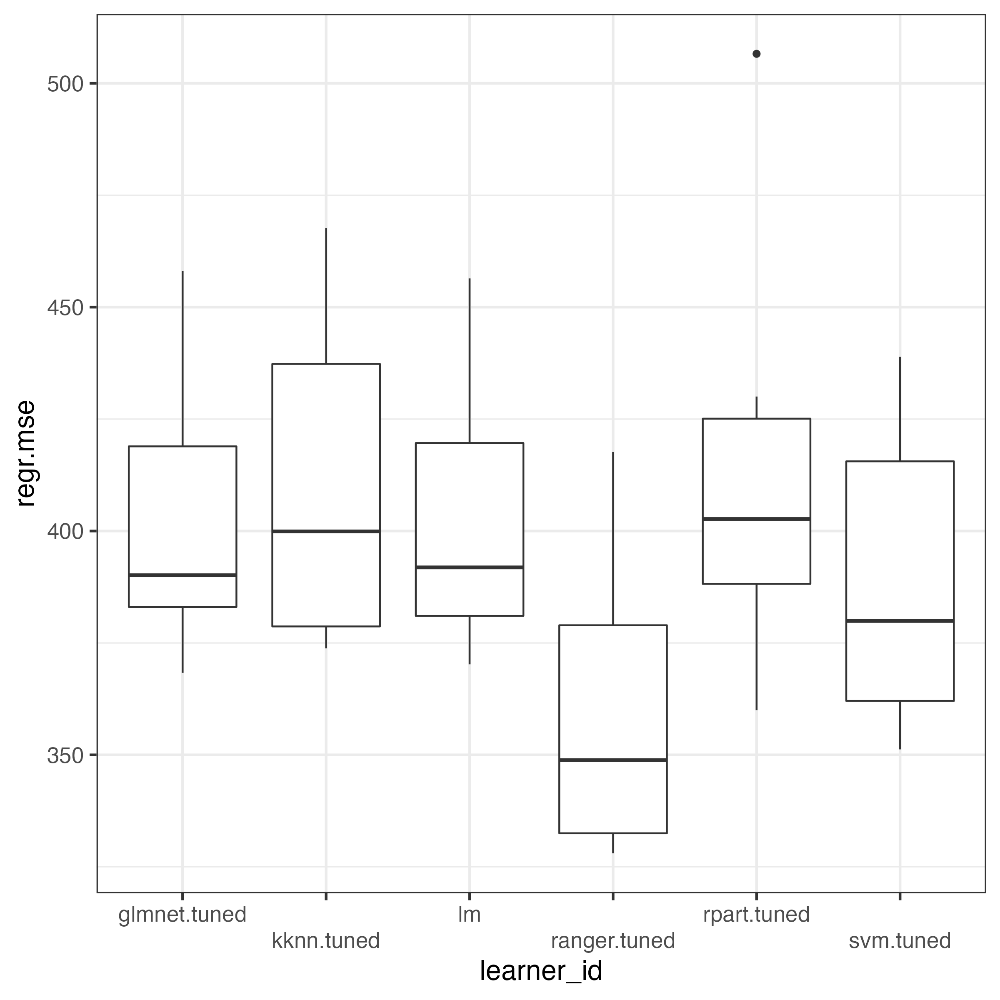
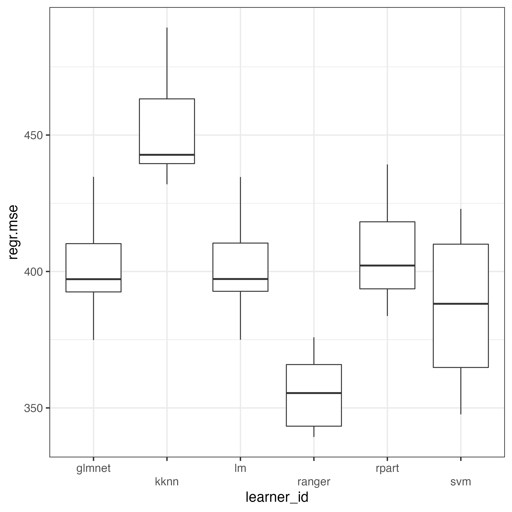

```{r setup, include = FALSE}
knitr::opts_chunk$set(echo = TRUE)
```

# C2: R code Kuhn et al. (2021) data set

> **Details regarding the outcome and the predictors (what they mean and their scales), see this demoSML documentation of the data set 'supplc'.**

New in this C2 vignette, compared to previous vignettes, especially compared to C1:

* Use of various, as opposed to just two, sML algorithms, competing against one another.
* Experimentation with several tuning values will take place, which is why the total sample size will be split into three parts (training, test, and validation subset; as in the B0 and B1 vignette), not just two (as in the C0 and C1 vignette).

The purpose of this C2 vignette is to find out whether any of the newly selected algorithms performs markedly better than the linear or the lasso regression model. As in the C1 vignette, we will again only use the original outcome values here, not the log-transformed values.

## Load required R package (install first, if not yet installed)
```{r echo=TRUE, eval = FALSE}
library(mlr3verse)
library(ggplot2)
```

Required data set is loaded automatically, once this demoSML package has been loaded.

```{r echo=TRUE, eval = FALSE}
library(demoSML)
# Assign data set supplc to variable name d
d <- supplc
```

## Step 1: Preprocessing

First, we will not include BADE_total in the predictor set (multicollinearity; see C0 vignette).

```{r echo=TRUE, eval = FALSE}
# Do not include BADE_total in the model (ignore index 11).
(analysis <- colnames(d)[c(1:10,12:13)])
```

## Step 2: Model selection

We will select a group of frequently used sML regression algorithms, which are available via [mlr3](https://mlr3book.mlr-org.com/) (Lang and Schratz, 2019):

* linear regression ([Model name: lm](https://stat.ethz.ch/R-manual/R-devel/library/stats/html/lm.html))
* lasso regression ([Model name: glmnet](https://glmnet.stanford.edu/))
* k-nearest neighbor ([Model name: kknn](https://cran.r-project.org/web/packages/kknn/index.html))
* recursive partitioning ([Model name: rpart](https://stat.ethz.ch/R-manual/R-devel/library/rpart/html/rpart.html)) Breiman et al. (1984)
* random forest ([Model name: ranger](https://github.com/imbs-hl/ranger)) Breiman (2001); [Breiman, 2003a](https://www.stat.berkeley.edu/%7Ebreiman/Using_random_forests_V3.1.pdf); [Breiman, 2003b](https://www.stat.berkeley.edu/%7Ebreiman/Using_random_forests_v4.0.pdf)
* support vector machines ([Model name: svm](https://cran.r-project.org/web/packages/e1071/vignettes/svmdoc.pdf)) Meyer et al. (2021)

Note: [mlr3](https://mlr3book.mlr-org.com/) provides an interface to many algorithms, which are part of several separate R packages. One major advantage of mlr3 may therefore be to learn the syntax of this interface package, instead of learning the specific syntax of any specific R package, whenever you want to use another algorithm.

The demonstrative setup for each of the selected algorithms will follow the exact same pattern, which is why we introduce the setup only once at this point:

1. The training and test subset (taken together) will be split into 4 parts (exactly as in the main document and in appendix C of the main document), which means that each of the tuning values will be cross-validated 4 times (= 4-fold cross-validation), each time with a different held-out test subset.
2. For each of the above algorithms, we will experiment with one of its tuning parameters, e.g., lambda in the lasso algorithm, or k in the k-nearest neighbor algorithm.
    + Note 1: Experimenting with two or more tuning parameters will increase computation time.
    + Note 2: The only exception is the linear regression model, because it has no tuning options.
3. For each algorithm, we will experiment with exactly 7 different tuning values. Therefore:
    + For each tuning value the same 4-fold cross-validation will be used (see point no.1 above).
    + Each tuning parameter will be instantiated as a range (minimum and maximum) of tuning values. Within this range, 7 (different) values will be randomly selected.
    + Next, the algorithm will run with the randomly selected tuning value (one at a time), using the training subset. This will generate the model coefficient estimates, which will be modified due to the currently selected tuning value.
    + Then each tuned model is evaluated (one at a time), using the test subset.
    + At the end, there are 7 different test prediction performance results.
    + The best of these 7 performance results will be used for the final evaluation of the algorithm's prediction performance, using the validation subset.
4. To evaluate an algorithm's performance, the prediction performance measure 'mean squared error' (mse) will be used. Best prediction performance is achieved with mse being lowest, compared to the competitor's mse results.
5. We employ *repeated k-fold cross-validation* for the final evaluation of each algorithm, with k being 3, repeated twice. That means that for each algorithm there will be 6 (3 times 2) final estimates of the final prediction performance available.
    + Note: For many sML applications *repeated k-fold cross-validation* has been recommended (Krstajic, 2014).

Linear regression model
```{r echo=TRUE, eval = FALSE}
# Select the linear regression regression model
linreg <- lrn("regr.lm", predict_sets=c("train", "test"))
# Command to z-transform predictors prior to model estimation.
linreg.z <- po("scale", center = TRUE) %>>% po("learner", linreg)
```

Lasso regression model
```{r echo=TRUE, eval = FALSE}
# Select the lasso regression model (glmnet, set alpha to 1).
lasso <- lrn("regr.glmnet", alpha = 1, predict_sets=c("train", "test"))
# Set the search space for the lasso tuning parameter lambda (s = selected lambda value).
search_spaceLO <- ps(s = p_dbl(lower = 0.001, upper = 0.5))
# Set the auto tuner, by providing all elements that are required.
# at = auto tuning, lo = lasso
at.lo <- AutoTuner$new(lasso, inner_rsmp, measure, terminator, tuner,
                       search_spaceLO, store_models = TRUE)
# atz = auto tuning, using z-transformed predictors
at.lo.z <- po("scale", center = TRUE) %>>% po("learner", at.lo)
```

k-nearest neighbor regression model
```{r echo=TRUE, eval = FALSE}
# Select the k-nearest neighbors model (knn).
knn <- lrn("regr.kknn", predict_sets=c("train", "test"))
# Set the search space for the knn tuning parameter k.
# k = number of data points in the neighborhood of any given data point, upon which the algorithm shall base its prediction.
searchSpaceKNN <- ps(k = p_int(lower = 1, upper = 20))
# Set the auto tuner, by providing all elements that are required.
# at = auto tuning, knn = k-nearest neighbors
at.knn <- AutoTuner$new(knn, inner_rsmp, measure, terminator, tuner,
                        searchSpaceKNN, store_models = TRUE)
# atz = auto tuning, using z-transformed predictors
at.knn.z <- po("scale", center = TRUE) %>>% po("learner", at.knn)
```

Recursive partitioning regression model
```{r echo=TRUE, eval = FALSE}
# Select the recursive partitioning (rpart) model.
rPart <- lrn("regr.rpart", predict_sets=c("train", "test"))
# Set the search space for the rpart tuning parameter cp.
# cp = factor by which the prediction performance shall be improved when adding another predictor.
searchSpaceRP <- ps(cp = p_dbl(lower = 0, upper = 0.04))
# Set the auto tuner, by providing all elements that are required.
# at = auto tuning, rp = rpart
at.rp <- AutoTuner$new(rPart, inner_rsmp, measure, terminator, tuner,
                       searchSpaceRP, store_models = TRUE)
# atz = auto tuning, using z-transformed predictors
at.rp.z <- po("scale", center = TRUE) %>>% po("learner", at.rp)
```

Random forest regression model
```{r echo=TRUE, eval = FALSE}
# Random forest (regr.ranger)
rf <- lrn("regr.ranger", predict_sets=c("train", "test"))
# Set the search space for the random forest parameter num.trees.
searchSpaceRF <- ps(num.trees = p_int(lower = 1, upper = 1000))
# at = auto tuning, rf = random forest
at.rf <- AutoTuner$new(rf, inner_rsmp, measure, terminator, tuner,
                           searchSpaceRF, store_models = TRUE)
# atz = auto tuning, using z-transformed predictors
at.rf.z <- po("scale", center = TRUE) %>>% po("learner", at.rf)
```

Support vector machine regression model
```{r echo=TRUE, eval = FALSE}
# Support vector machine (regr.svm)
svm <- lrn("regr.svm", kernel="radial", type="eps-regression", predict_sets=c("train", "test"))
# Set the search space for the svm parameter cost.
searchSpaceSVM = ps(cost = p_dbl(lower = 0, upper = 1))
# at = auto tuning, svm = support vector machine
at.svm <- AutoTuner$new(svm, inner_rsmp, measure, terminator, tuner,
                        searchSpaceSVM, store_models = TRUE)
# atz = auto tuning, using z-transformed predictors
at.svm.z <- po("scale", center = TRUE) %>>% po("learner", at.svm)
```

## Steps 3-6

Steps 3-6 are part of the following code, even though they look different, compared to the previous vignettes (see headline 'Supervised ML - Hide and seek' in the vignette 'A0 demoSML Read me first').

```{r echo=TRUE, eval = FALSE}
# Set the prediction task to be regression (TaskRegr)
tskReg <- TaskRegr$new(id="dReg", backend=d[,analysis], target="covid_general_total")
# mlr3 output
<TaskRegr:dReg> (1597 x 12)
* Target: covid_general_total
* Properties: -
* Features (11):
  - dbl (11): BADE_emot, BADE_neutr, JTC_decthreshold, JTC_extreme,
    PCL_total, age, country, polit_orient, poss_mistaken, sex,
    years_edu

# Steps 3 - 5 (T U N I N G   T R A I N I N G   T E S T)
# Set inner resampling to cross-validation with 4 folds.
inner_rsmp <- rsmp("cv", folds = 4)
# mlr3 output
<ResamplingCV>: Cross-Validation
* Iterations: 4
* Instantiated: FALSE
* Parameters: folds=4

# Step 3  T U N I N G
# Set the number of different tuning parameters, after which to stop.
terminator <- trm("evals", n_evals = 7)
# mlr3 output
<TerminatorEvals>: Number of Evaluation
* Parameters: n_evals=7, k=0

# Step 3  T U N I N G
# Set the automatic search of the optimal tuning value to be random.
tuner <- tnr("random_search")
# mlr3 output
<TunerRandomSearch>: Random Search
* Parameters: batch_size=1
* Parameter classes: ParamLgl, ParamInt, ParamDbl, ParamFct
* Properties: dependencies, single-crit, multi-crit
* Packages: mlr3tuning, bbotk

# Steps 5 and 6  T E S T  and  V A L I D A T I O N  performance measure.
# Select mean squared error as the prediction performance measure.
measure <- msr("regr.mse")
# mlr3 output
<MeasureRegrSimple:regr.mse>: Mean Squared Error
* Packages: mlr3, mlr3measures
* Range: [0, Inf]
* Minimize: TRUE
* Average: macro
* Parameters: list()
* Properties: -
* Predict type: response
```

Run the competition:
```{r echo=TRUE, eval = FALSE}
# Step 6  V A L I D A T I O N
# Set the outer resampling to repeated cross-validation, with 2 repetitions and 3 folds.
outer_rsmp <- rsmp("repeated_cv", repeats = 2, folds = 3)
# Set up the competition design.
design <- benchmark_grid(tasks = tskReg,
                         learners=list(linreg.z,
                                       at.lo.z,
                                       at.rp.z,
                                       at.knn.z,
                                       at.rf.z,
                                       at.svm.z),
                         resamplings = outer_rsmp)
# set.seed ensures reproducibility of results.
set.seed(1)
# Start the competition. bmr = benchmark result
bmr <- benchmark(design, store_models = TRUE)
```

We can see that the task (tskReg) has been passed to the mlr3 function benchmark_grid. Also all learners (with the predictors being z-transformed) and the validation resampling method has been passed to benchmark_grid.

Finally, the competition between all models is started by using the benchmark function (models can be stored, if the user wants to: store_models = TRUE). The variable name bmr will contain all results.

Visualize the test performance results, in order to see whether any of the newly selected algorithms performed markedly better than the linear or the lasso regression model.
```{r echo=TRUE, eval = FALSE}
# Collect the six validation performances of all algorithms
bmrPerf <-
as.data.frame(as.data.table(bmr$score()[,c("learner_id", "regr.mse")]))
# Make the names of the algorithms shorter by removing 'scale.regr'
bmrPerf$learner_id <- gsub("scale.regr.", "", bmrPerf$learner_id)
# Visualize results with boxplots
ggplot(data=bmrPerf, aes(x=learner_id, y=regr.mse)) +
    geom_boxplot() +
    theme_bw(base_size=16) +
    scale_x_discrete(guide = guide_axis(n.dodge = 2.5)) +
    # Set y-axis so that both boxplot figures can be easily compared.
    scale_y_continuous(breaks = c(350, 400, 450, 500))
```

{width=500pt, height=500pt}

**Conclusion**

The random forest model performed markedly better than the lasso or the linear regression model. This tells us that in order to predict the outcome as accurately as possible (given the 12 predictors), non-linear associations between predictors and the outcome and/or interactions between some of the predictors appear to be beneficial.

## Additional question

What if we wanted to know whether tuning improved the final prediction performance results? After all, the computation took 2 minutes. What if we achieved the same results, using the default tuning values of all tuning parameters (computation takes about 10 seconds).

To answer this question, we re-ran the above analyses, using the default tuning parameters of all algorithms which possess tuning options:

```{r echo=TRUE, eval = FALSE}
# Select models
# linear regression
linreg <- lrn("regr.lm", predict_sets=c("train", "test"))
linreg.z <- po("scale", center = TRUE) %>>% po("learner", linreg)
# Lasso regression
lasso <- lrn("regr.glmnet", alpha = 1, predict_sets=c("train", "test"))
lo.z <- po("scale", center = TRUE) %>>% po("learner", lasso)
# k-nearest neighbor
knn <- lrn("regr.kknn", predict_sets=c("train", "test"))
knn.z <- po("scale", center = TRUE) %>>% po("learner", knn)
# Recursive partitioning
rPart <- lrn("regr.rpart", predict_sets=c("train", "test"))
rp.z <- po("scale", center = TRUE) %>>% po("learner", rPart)
# Random forest
rf <- lrn("regr.ranger", predict_sets=c("train", "test"))
rf.z <- po("scale", center = TRUE) %>>% po("learner", rf)
# Support vector machine
svm <- lrn("regr.svm", predict_sets=c("train", "test"))
svm.z <- po("scale", center = TRUE) %>>% po("learner", svm)

# Set the prediction task to be regression (TaskRegr)
tskReg <- TaskRegr$new(id="dReg", backend=d[,analysis], target="covid_general_total")
# Set inner resampling to cross-validation with 4 folds.
inner_rsmp <- rsmp("cv", folds = 4)
# Set the number of different tuning parameters, after which to stop.
terminator <- trm("evals", n_evals = 7)
# Set the automatic tuning to be random.
tuner <- tnr("random_search")
# Select mean squared error as the prediction performance measure.
measure = msr("regr.mse")
# Resampling for the final prediction performance
outer_rsmp <- rsmp("repeated_cv", repeats = 2, folds = 3)
# Set up the competition design.
design <- benchmark_grid(tasks = tskReg,
                         learners=list(linreg.z,
                                       lo.z,
                                       rp.z,
                                       knn.z,
                                       rf.z,
                                       svm.z),
                         resamplings = outer_rsmp)
# set.seed ensures reproducibility of results.
set.seed(1)
# Start the competition. bmr = benchmark result
bmr <- benchmark(design, store_models = TRUE)
# Collect the six validation performances of all algorithms
bmrPerf <-
    as.data.frame(as.data.table(bmr$score()[,c("learner_id", "regr.mse")]))
# Make the names of the algorithms shorter by removing 'scale.regr'
bmrPerf$learner_id <- gsub("scale.regr.", "", bmrPerf$learner_id)
# Visualize results with boxplots
ggplot(data=bmrPerf, aes(x=learner_id, y=regr.mse)) +
    geom_boxplot() +
    theme_bw(base_size=16) +
    scale_x_discrete(guide = guide_axis(n.dodge = 2.5)) +
    # Set y-axis so that both boxplot figures can be easily compared.
    scale_y_continuous(breaks = c(350, 400, 450, 500))
```

{width=500pt, height=500pt}


**Conclusion**

The random forest model still performed markedly better than the other models. The k-nearest neighbor model performed much worse than with tuning. In the other models, no large differences appear between the tuned and the non-tuned performance results.

Notably, the used data set (Kuhn et al., 2021) is based on a cross-sectional study design. In order to 'predict' an outcome, longitudinal study designs are preferred, where predictors were measured prior to the outcome. For instance, if the outcome is a mental disorder, the predictors of the study baseline are often used to predict the first lifetime development of the mental disorder at follow up. (Outcome cases at baseline must have been removed before fitting the training model.)

**References**

Breiman L., Friedman J. H., Olshen R. A., and Stone, C. J. (1984) *Classification and Regression Trees*. Wadsworth.

Breiman, L. (2001). Random forests. *Machine learning*, *45*(1), 5-32.

Kuhn, S.A.K., Lieb, R., Freeman, D., Andreou, C., Zander-Schellenberg, T. (2021). Coronavirus conspiracy beliefs in the German-speaking general population: endorsement rates and links to reasoning biases and paranoia. *Psychological Medicine* 1–15. [https://doi.org/10.1017/S0033291721001124](https://doi.org/10.1017/S0033291721001124)

Lang, M. & Schratz, P. (2021). mlr3verse: Easily Install and Load the 'mlr3' Package Family. [https://mlr3verse.mlr-org.com](https://mlr3verse.mlr-org.com), [https://github.com/mlr-org/mlr3verse](https://github.com/mlr-org/mlr3verse).

Meyer, D., Dimitriadou, E., Hornik, K., Weingessel, A., and Leisch, F. (2021). e1071: Misc Functions of the Department of Statistics, Probability Theory Group (Formerly: E1071), TU Wien. R package version 1.7-9. [https://CRAN.R-project.org/package=e1071](https://CRAN.R-project.org/package=e1071)