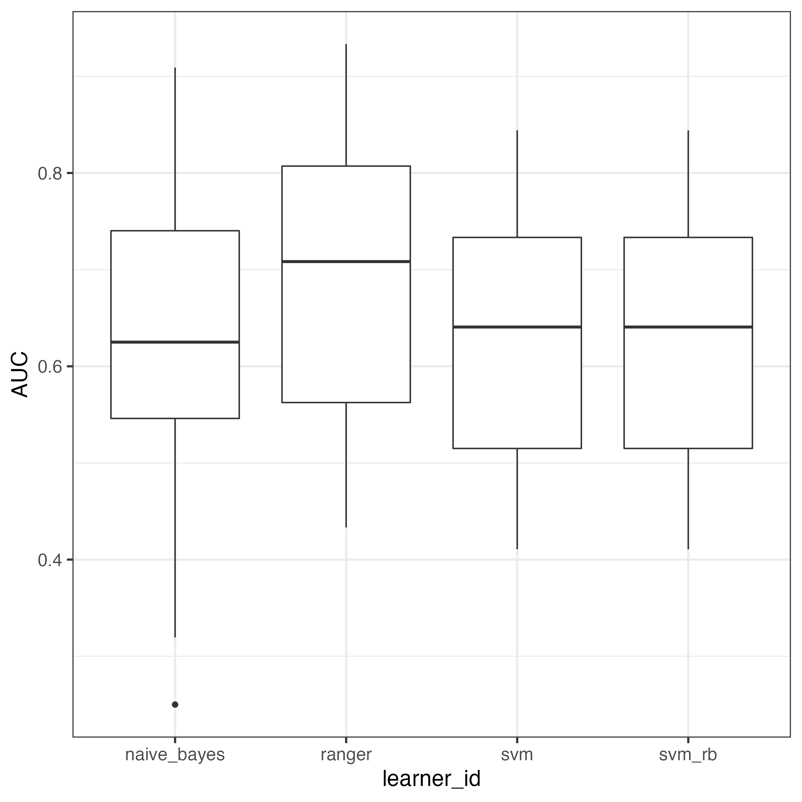

```{r setup, include = FALSE}
knitr::opts_chunk$set(echo = TRUE)
```

# D: R code Wahl et al. (2022) data set

> **Details regarding the outcome and the predictors (what they mean and their scales), see this demoSML documentation of the data set 'suppld'.**

New in this D vignette, compared to previous vignettes:

* The outcome that shall be predicted is binary, as opposed to continuous.
* The predictors do not stem from self-reports but from sensor data in a smartwatch that was worn around the wrist while washing the hands.
* Instead of a psychologically relevant construct, such as corona-related conspiracy theory beliefs (see vignettes C0-C2), in this D vignette compulsive hand-washing is psychologically relevant (behavior instead of a belief). Methodologically, it is relevant whether this behavior can be accurately detected, using sML, and based on the sensor data that has been collected with a smartwatch. For details, see Wahl et al. (2022).
* The sML demonstration code below replicates part of the results that Wahl et al. (2022) published. That is, the sML research has not been conducted specifically for this supplementary demoSML package.

## Load required R package (install first, if not yet installed)
```{r echo=TRUE, eval = FALSE}
library(mlr3verse)
library(ggplot2)
```

Required data set is loaded automatically, once this demoSML package has been loaded.

```{r echo=TRUE, eval = FALSE}
library(demoSML)
# Assign data set suppld to variable name d
d <- suppld
```

## Step 1: Preprocessing

The raw data and its preprocessing is beyond the scope of this demoSML package. That is, advanced Python programming skills are required to extract the raw data, not to mention preprocessing the raw data (see Wahl et al., 2022, section 2, Methods, subsections 2.7, 2.8, and 2.9). Therefore, we present the post-processed data.

Structure of the data set:
```{r echo=TRUE, eval = FALSE}
# Display structure of d
str(d)
# Output in console
'data.frame':	453 obs. of  8 variables:
 $ subject   : int  1 1 1 1 1 1 1 1 1 1 ...
 $ washType  : Factor w/ 2 levels "compulsive","natural": 2 2 2 1 1 1 1 1 1 1 ...
 $ washScript: chr  "E" "E" "E" "E" ...
 $ gyr_y_vr  : num  0.654 0.118 0.059 0.118 0.102 ...
 $ gyr_z_vr  : num  0.238 0.2682 0.0835 0.1143 0.0957 ...
 $ mag_x_vr  : num  71.8 50.3 16.7 98.5 16.1 ...
 $ q2_z_mn   : num  0.1169 0.6302 0.922 0.1631 0.0773 ...
 $ q2_z_vr   : num  0.360852 0.042342 0.000104 0.224646 0.287895 ...
```

The first column 'subject' contains the 21 participants, each participant having multiple sensor measurements. The second column 'washType' contains the two hand-washing conditions: 'natural' and 'compulsive'. This is the **binary outcome** that shall be accurately predicted by an sML algorithm. The third column 'washScript' contains one out of five different written descriptions of how to wash the hands compulsively.

For details about the sensor data, see this demoSML documentation of the data set 'suppld' and/or Wahl et al. (2022). The abbreviations 'vr' and 'mn' represent variance and mean, respectively.

Outcome base rate $\approx 67\%$.
```{r echo=TRUE, eval = FALSE}
# Overview of class balance of the binary outcome 'washType'.
table(d$washType)
# Output in console
compulsive    natural 
       303        150

# Outcome base rate 
prop.table(table(d$washType))
# Output in console
compulsive    natural 
 0.6688742  0.3311258
```

In the total sample (453 rows), approximately 67% are labeled as compulsive hand-washes, whereas approximately 33% are labeled as natural hand-washes.

Note. The outcome is imbalanced. However, there seem to be no clear criteria as to when outcome class 'imbalance' requires to be taken into account, before, while, and/or after applying sML. One paper (He and Garcia, 2009) indicates that class ratios of between 100:1 and 10'000:1 can be considered severely imbalanced data. The present class ratio of 2:1 therefore does not appear to be alarmingly high.

## Step 2: Model selection

See Wahl et al. (2022), section 2, Methods, subsection 2.9.1, Machine learning model: 'We tested four classification models: linear support vector machine (SVM), SVM with radial basis functions, random forest (RF), and naive Bayes (NB). Each classifier was tested on the hand-washing classification task. Classifiers were run with default parameters; no hyperparameter optimization was attempted.'

**Support vector machine (SVM)** (Model name in boxplot (below): svm)
```{r echo=TRUE, eval = FALSE}
SVM <- lrn("classif.svm", predict_type = "prob", predict_sets=c("train", "test"))
```

**SVMRB with radial basis function** (Model name in boxplot (below): svm_rb)
```{r echo=TRUE, eval = FALSE}
SVMRB <- lrn("classif.svm", type = "C-classification", kernel = "radial", predict_type = "prob", predict_sets=c("train", "test"))
# Rename the id so that the difference between SVM and SVMRB in the results overview can be easily discerned.
SVMRB$id <- "classif.svm_rb"
```

**Random Forest** (Model name in boxplot (below): ranger)
```{r echo=TRUE, eval = FALSE}
RANDOMFOREST <- lrn("classif.ranger", predict_type = "prob", predict_sets=c("train", "test"))
```

**Naive Bayes** (Model name in boxplot (below): naive_bayes)
```{r echo=TRUE, eval = FALSE}
NAIVEBAYES <- lrn("classif.naive_bayes", predict_type = "prob", predict_sets=c("train", "test"))
```

Naive Bayes is the only algorithm that is new, compared to the previous vignettes. The R package that [mlr3](https://mlr3book.mlr-org.com/) uses for this algorithm, is the [e1071](https://cran.r-project.org/web/packages/e1071/index.html) package (Meyer et al., 2021).

## Step 3: Model tuning

Default tuning parameter values were accepted.

## Steps 4 and 5: Model training and testing

Since tuning did not take place, the total sample required only two subsets: A training and a test subset. (See also vignette C0 and C1 of this demoSML package, where we also split the total sample in two subsets, instead of three.)

The selected cross-validation setup (see Wahl et al., 2022, section 2, Methods, subsection 2.10) was 'leave-one-subject-out'. The idea behind this was that the algorithm is trained with all but one study participants (*N* = 20), after which the held-out participant's hand-washing condition should be correctly detected. This leave-one-subject-out setup can be achieved with the [mlr3](https://mlr3book.mlr-org.com/) custom resampling option.

```{r echo=TRUE, eval = FALSE}
# Two empty lists (trainRsmp and testRsmp) which consecutively will be filled with the rows of the data set that represent a single individual (see column name 'subject' of the data set d); 21 loops, due to one loop per subject.
trainRsmp <- testRsmp <- list()
for(i in unique(d$subject)) {
    # Training sample = All except for one subject.
    trainRsmp[[as.character(i)]] <- (1:nrow(d))[-which(d$subject == i)]
    # Final test sample = The subject that was not part of the training sample.
    testRsmp[[as.character(i)]] <- which(d$subject == i)
}
# Check that each of the two lists contains 21 entries.
length(trainRsmp); length(testRsmp)
# Output in console
[1] 21
[1] 21
```

With 21 participants there are 21 training sessions and 21 test performances in total. One training session contains 20 participants, while the held-out subject is the test case.

## Define the prediction task

Classification task refers to the prediction of a binary outcome.

```{r echo=TRUE, eval = FALSE}
# tskBin = task for binary outcome. Outcome variable: washType, class that shall be predicted: compulsive hand-washing.
(tskBin <- TaskClassif$new(id="dClassif", backend=d[,-(1:2)], target="washType", positive = "compulsive"))
# Output in console
<TaskClassif:dClassif> (453 x 6)
* Target: washType
* Properties: twoclass
* Features (5):
  - dbl (5): gyr_y_vr, gyr_z_vr, mag_x_vr, q2_z_mn, q2_z_vr

# Select mlr3's custom resampling option
resamplingCustom <- rsmp("custom")
# Instantiate custom resampling with the lists for training and for testing.
(resamplingCustom$instantiate(tskBin, train_sets = trainRsmp, test_sets = testRsmp))
# Output in console
<ResamplingCustom>: Custom Splits
* Iterations: 21
* Instantiated: TRUE
* Parameters: list()

# Leave-one-subject-out cross validation setup
design = benchmark_grid(
    tasks = tskBin,
    learners = list(SVM,
                    SVMRB,
                    RANDOMFOREST,
                    NAIVEBAYES),
    resamplings = resamplingCustom)

# Run the competition
bmr <- benchmark(design, store_models = TRUE)
```

## Competition result

The so-called area under the receiver operating characteristic curve ('AUC') is a very frequently used performance measure for classification tasks (predict a binary outcome). It shows the global discriminatory performance of a model. Higher AUC values mean better prediction performance. Worse and perfect prediction is shown by an AUC of 0.5 and 1, respectively.

```{r echo=TRUE, eval = FALSE}
measures <- list(msr("classif.auc", id = "AUC"))
bmr$aggregate(measures)[,c("learner_id", "AUC")]
# Output in console
            learner_id       AUC
1:         classif.svm 0.6355246
2:      classif.svm_rb 0.6355246
3:      classif.ranger 0.6909646
4: classif.naive_bayes 0.6219109
```

The random forest model showed the best test performance (mean AUC = 0.69). That means that the random forest model was on average about 20% better in correctly predicting the hand-washing type, compared to taking a random guess (tossing a perfect coin) to predict the hand-washing type in this study sample.

{width=500pt, height=500pt}

Despite the median performance being best in the random forest model (model name: ranger), its range of the 21 prediction performances overlaps largely with the range of the other three models. This shows that prediction models require improvement. However, this makes sense because this study of Wahl et al. (2022) was the pilot project for investigating whether wearables might be beneficial for treating patients with obsessive-compulsive disorder, with compulsive hand-washing as their main symptomatology.

**References**

Meyer, D., Dimitriadou, E., Hornik, K., Weingessel, A., and Leisch, F. (2021). e1071: Misc Functions of the Department of Statistics, Probability Theory Group (Formerly: E1071), TU Wien. R package version 1.7-9. [https://CRAN.R-project.org/package=e1071](https://CRAN.R-project.org/package=e1071)

He, H., & Garcia, E. A. (2009). Learning from imbalanced data. *IEEE Transactions on knowledge and data engineering*, *21*(9), 1263-1284.

Lang, M. & Schratz, P. (2021). mlr3verse: Easily Install and Load the 'mlr3' Package Family. [https://mlr3verse.mlr-org.com](https://mlr3verse.mlr-org.com), [https://github.com/mlr-org/mlr3verse](https://github.com/mlr-org/mlr3verse).

Wahl, K., Scholl, P. M., Wirth, S., Miché, M., Häni, J., Schülin, P., & Lieb, R. (2022). On the automatic detection of enacted compulsive hand washing using commercially available wearable devices. Computers in *Biology and Medicine*, *143*, 105280. [https://doi.org/10.1016/j.compbiomed.2022.105280](https://doi.org/10.1016/j.compbiomed.2022.105280)